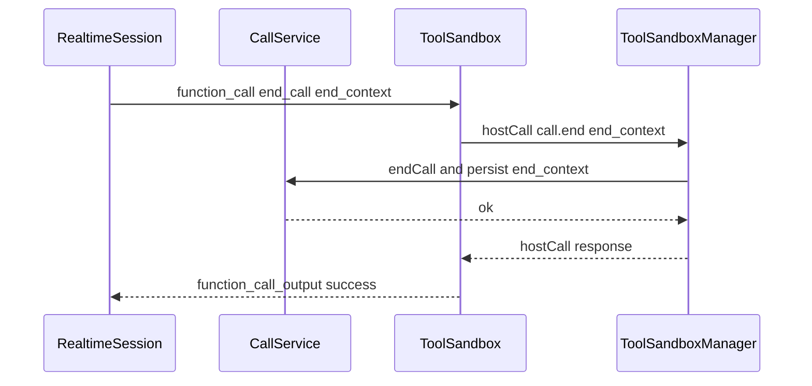
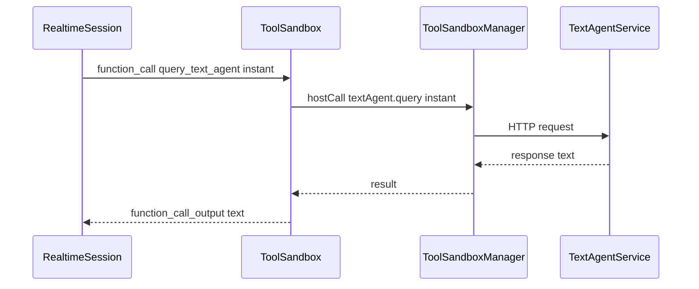
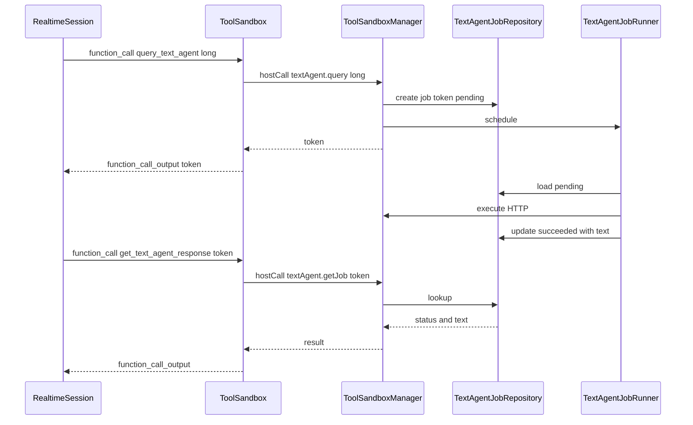

# Architecture Design: End Call Tool + Text Agents + Agents Management

This document designs three features for the Flutter/Dart voice agent system:
- Tool `end_call` (programmatic termination with optional `end_context`)
- Text Agent tools: `query_text_agent`, `get_text_agent_response`
- Agent selection & management (Agents tab CRUD + selection)

It follows existing patterns in [`lib/services/tools_runtime/tool_sandbox_manager.dart`](lib/services/tools_runtime/tool_sandbox_manager.dart:1), [`lib/repositories/json_speed_dial_repository.dart`](lib/repositories/json_speed_dial_repository.dart:1), and [`lib/feat/speed_dial/screens/config.dart`](lib/feat/speed_dial/screens/config.dart:1).

---

## 0. Existing Architecture Summary (baseline)

### Call lifecycle
- [`CallService.endCall()`](lib/services/call_service.dart:457) handles user-driven call termination and already:
  - plays end tone
  - saves session via [`CallService._saveSession()`](lib/services/call_service.dart:475)
  - cleans up streams and sandbox

### Tool runtime + sandbox
- Runtime tool definitions are `function` tools sent to Azure Realtime via [`ToolDefinition.toRealtimeJson()`](lib/services/tools_runtime/tool_definition.dart:47).
- Tools execute in a sandbox worker coordinated by [`ToolSandboxManager.execute()`](lib/services/tools_runtime/tool_sandbox_manager.dart:160).
- Worker-to-host privileged actions occur via `hostCall` routing in [`ToolSandboxManager._handleHostCall()`](lib/services/tools_runtime/tool_sandbox_manager.dart:380) to host APIs (today: notepad, memory).

### Repository + JSON storage pattern
- Storage is a single JSON file key-value map via [`JsonFileStore`](lib/core/data/json_file_store.dart:12).
- Feature repos store list-like values under a stable key, e.g. `_speedDialsKey` in [`JsonSpeedDialRepository`](lib/repositories/json_speed_dial_repository.dart:9).
- Riverpod refresh pattern uses `ref.invalidate(...)` as described in [`speedDialsProvider`](lib/feat/speed_dial/state/speed_dial_providers.dart:7).

---

## 1. Text Agent Model Schema

### 1.1 Goals
- Support multiple configured text agents, each with its own:
  - endpoint + API key + API version (as requested)
  - deployment or model identifier
  - specialization/instructions
  - sampling config
- Provide metadata for UI listing and tool output.
- Allow selecting a default agent for call usage.

### 1.2 Dart model (proposed)
Create a new model class:
- [`class TextAgent`](lib/feat/text_agents/models/text_agent.dart:1)

Recommended fields:
- `id: String` (stable UUID-ish string)
- `name: String` (display name)
- `description: String?` (short summary)
- `specialization: String?` (what it is good at)
- `provider: TextAgentProvider` enum (initial: `azureOpenAI`)
- `azure: AzureTextAgentConfig` (provider-specific config)
- `createdAt: DateTime`
- `updatedAt: DateTime`
- `isArchived: bool` (soft delete option; UI can hide)

Provider-specific config:
- [`class AzureTextAgentConfig`](lib/feat/text_agents/models/azure_text_agent_config.dart:1)
  - `endpoint: String` (https URL)
  - `apiKey: String` (sensitive)
  - `apiVersion: String` (e.g. 2024-10-21)
  - `deployment: String` (Azure deployment name)
  - `systemPrompt: String?` (agent-level instruction)
  - `temperature: double?` (0..2)
  - `topP: double?`
  - `maxOutputTokens: int?`
  - `timeoutMs: int?` (per-agent override)

Notes:
- For security, storing `apiKey` in JSON is acceptable per requested requirements, but the design also supports migrating to secure storage later by marking `apiKey` as a “secret field” and storing only a key reference.

### 1.3 JSON storage format
Store agents in the existing `vagina_config.json` key-value store under a new key.

- Key: `text_agents`
- Value: array of agent JSON objects

Example structure (inside the KV json file):

```json
{
  "speed_dials": [/* ... */],
  "text_agents": [
    {
      "id": "ta_1730000000000",
      "name": "Research Helper",
      "description": "Long-form analysis",
      "specialization": "Summaries, planning",
      "provider": "azureOpenAI",
      "azure": {
        "endpoint": "https://example.openai.azure.com",
        "apiKey": "***",
        "apiVersion": "2024-10-21",
        "deployment": "gpt-4o-mini",
        "systemPrompt": "You are a helpful research assistant.",
        "temperature": 0.2,
        "maxOutputTokens": 1200,
        "timeoutMs": 60000
      },
      "createdAt": "2026-01-18T00:00:00.000Z",
      "updatedAt": "2026-01-18T00:00:00.000Z",
      "isArchived": false
    }
  ],
  "selected_text_agent_id": "ta_1730000000000",
  "text_agent_jobs": [
    {
      "token": "job_abc",
      "agentId": "ta_1730000000000",
      "status": "pending",
      "createdAt": "2026-01-18T00:00:00.000Z",
      "updatedAt": "2026-01-18T00:00:00.000Z",
      "promptHash": "sha256:...",
      "expectLatency": "long"
    }
  ]
}
```

Async job persistence is covered in section 2.

---

## 2. Text Agent Service Architecture

### 2.1 Requirements
- Tool `query_text_agent` supports three latency tiers:
  - `instant`: return response immediately
  - `long` and `ultra_long`: return a token immediately; response is retrieved later via `get_text_agent_response(token)`
- Polling-based retrieval.
- Async tokens must persist across app restarts.

### 2.2 API choice (Azure OpenAI)
Use Azure OpenAI “Responses” API (recommended modern API), via HTTPS using `http` package.

- Instant queries: send request and wait synchronously for completion.
- Long/ultra-long queries: also use HTTPS but do not block tool execution; create a job record and perform work in background.

If the project already uses a different Azure text-completions/chat endpoint elsewhere, the service should wrap whichever HTTP client is already used, but the contract remains.

### 2.3 Core service contracts
Create a feature service:
- [`class TextAgentService`](lib/feat/text_agents/services/text_agent_service.dart:1)

Key methods:
- [`Future<TextAgentInstantResult> queryInstant()`](lib/feat/text_agents/services/text_agent_service.dart:1)
- [`Future<TextAgentAsyncToken> queryAsync()`](lib/feat/text_agents/services/text_agent_service.dart:1)
- [`Future<TextAgentJobSnapshot> getJob()`](lib/feat/text_agents/services/text_agent_service.dart:1)
- [`Future<void> pollOrAdvanceJob()`](lib/feat/text_agents/services/text_agent_service.dart:1)

Supporting types:
- [`sealed class TextAgentQueryLatency`](lib/feat/text_agents/models/text_agent_query_latency.dart:1) with values: `instant`, `long`, `ultraLong`
- [`class TextAgentJob`](lib/feat/text_agents/models/text_agent_job.dart:1)
- [`enum TextAgentJobStatus`](lib/feat/text_agents/models/text_agent_job.dart:1) values: `pending`, `running`, `succeeded`, `failed`, `expired`

### 2.4 Async job execution model
Given tools run in an isolate sandbox and should return promptly, async operations must execute on the host side.

Design:
1. `query_text_agent` tool request hits sandbox.
2. Tool performs hostCall `textAgent.query`.
3. Host-side adapter creates a durable `TextAgentJob` with a `token` and persists it.
4. Host schedules background execution using a single in-app “job runner” that:
   - runs while app is alive (foreground; optionally background on mobile if permitted)
   - rehydrates unfinished jobs on startup
5. `get_text_agent_response(token)` tool performs hostCall `textAgent.getJob`:
   - if job is `succeeded`, return result
   - if `pending/running`, return status and recommended poll-after
   - if `failed/expired`, return error payload

Job runner placement:
- [`class TextAgentJobRunner`](lib/feat/text_agents/services/text_agent_job_runner.dart:1)
  - uses a `Timer` or a `Stream` loop with concurrency limit (e.g. 1–2 jobs at a time)
  - uses `TextAgentService` for HTTP execution

### 2.5 Token format
Token is an opaque string (no embedded secrets), e.g. `job_${timestamp}_${random}`.

The job token should be treated like a primary key.

### 2.6 Polling and timeouts
Timeout strategy:
- For HTTP request: use per-agent `timeoutMs` with defaults per latency tier:
  - instant: 15–30s
  - long: 120s
  - ultra_long: 300s (or more), but job runner should chunk work and allow retries

Retry strategy:
- Retry transient network errors with exponential backoff capped.
- Mark job `failed` after N failures (configurable) with captured last error.

Expiration strategy:
- Jobs `pending/running` beyond TTL become `expired`:
  - long TTL: e.g. 1 hour
  - ultra_long TTL: e.g. 24 hours

### 2.7 Result shape
A completed job stores:
- raw `text: String` (final response)
- optional `usage` and `model` metadata
- optional `citations` or structured outputs later

---

## 3. New Tool Definitions

All tools are Realtime function tools consistent with [`ToolDefinition.toRealtimeJson()`](lib/services/tools_runtime/tool_definition.dart:47).

### 3.1 Tool: end_call
- Tool key: `end_call`
- Purpose: end current call programmatically.
- Parameters:
  - `end_context: object?` optional, arbitrary JSON that captures “why/what state”.

Function schema (JSON Schema in `parametersSchema`):

```json
{
  "type": "object",
  "properties": {
    "end_context": {
      "type": "object",
      "description": "Optional state to persist for future resumption. Should be small and non-sensitive."
    }
  },
  "required": []
}
```

Tool output (stringified JSON):
- success: `{ "success": true, "ended": true }`
- failure: `{ "success": false, "error": "..." }`

Important integration constraint:
- The tool sandbox isolate cannot directly access [`CallService.endCall()`](lib/services/call_service.dart:457).
- Therefore `end_call` must be implemented as a sandbox tool that performs a hostCall to a new host API `call.end`.

### 3.2 Tool: query_text_agent
Tool key: `query_text_agent`

Parameters:
- `agent_id: string` required
- `prompt: string` required
- `expect_latency: string` required enum: `instant`, `long`, `ultra_long`

Schema:

```json
{
  "type": "object",
  "properties": {
    "agent_id": { "type": "string", "description": "Text agent id" },
    "prompt": { "type": "string", "description": "User query" },
    "expect_latency": {
      "type": "string",
      "enum": ["instant", "long", "ultra_long"],
      "description": "Expected latency tier"
    }
  },
  "required": ["agent_id", "prompt", "expect_latency"]
}
```

Return contracts:
- If `instant`: `{ "success": true, "mode": "instant", "text": "...", "agent_id": "..." }`
- If `long/ultra_long`: `{ "success": true, "mode": "async", "token": "job_...", "agent_id": "...", "poll_after_ms": 1500 }`

### 3.3 Tool: get_text_agent_response
Tool key: `get_text_agent_response`

Parameters:
- `token: string` required

Schema:

```json
{
  "type": "object",
  "properties": {
    "token": { "type": "string", "description": "Async job token" }
  },
  "required": ["token"]
}
```

Return contracts:
- running: `{ "success": true, "status": "running", "poll_after_ms": 1500 }`
- succeeded: `{ "success": true, "status": "succeeded", "text": "..." }`
- failed: `{ "success": false, "status": "failed", "error": "..." }`
- expired: `{ "success": false, "status": "expired", "error": "Job expired" }`

### 3.4 Tool: list_available_agents
Tool key: `list_available_agents`

Parameters: none.

Schema:

```json
{
  "type": "object",
  "properties": {},
  "required": []
}
```

Return:

```json
{
  "success": true,
  "agents": [
    {
      "id": "...",
      "name": "...",
      "description": "...",
      "specialization": "...",
      "provider": "azureOpenAI",
      "model_or_deployment": "..."
    }
  ]
}
```

### 3.5 Parameter validation rules
Validation should happen twice:
1. In tool implementation (fast fail with clear `error`)
2. In host APIs (treat sandbox input as untrusted)

Validation rules:
- `agent_id` must exist and not be archived
- `expect_latency` must be one of the enums
- `prompt` non-empty and within size limit (to protect UI memory and HTTP payload)

---

## 4. Repository Layer

### 4.1 Interfaces
Add new interfaces:
- [`abstract class TextAgentRepository`](lib/interfaces/text_agent_repository.dart:1)
- [`abstract class TextAgentJobRepository`](lib/interfaces/text_agent_job_repository.dart:1)

Suggested methods for agents:
- `Future<void> save(TextAgent agent)`
- `Future<List<TextAgent>> getAll({bool includeArchived = false})`
- `Future<TextAgent?> getById(String id)`
- `Future<bool> update(TextAgent agent)`
- `Future<bool> delete(String id)` (either hard delete or archive)

Suggested methods for jobs:
- `Future<void> upsert(TextAgentJob job)`
- `Future<TextAgentJob?> getByToken(String token)`
- `Future<List<TextAgentJob>> listActive()`
- `Future<void> deleteByToken(String token)`
- `Future<void> purgeExpired()`

### 4.2 JSON implementations
Implementations mirror [`JsonSpeedDialRepository`](lib/repositories/json_speed_dial_repository.dart:1):
- [`class JsonTextAgentRepository`](lib/repositories/json_text_agent_repository.dart:1)
  - store key `text_agents`
- [`class JsonTextAgentJobRepository`](lib/repositories/json_text_agent_job_repository.dart:1)
  - store key `text_agent_jobs`

### 4.3 Repository factory integration
Extend [`RepositoryFactory`](lib/repositories/repository_factory.dart:16) and [`repository_providers.dart`](lib/core/state/repository_providers.dart:1) to expose these repos.

---

## 5. State Management (Riverpod)

### 5.1 Providers
Following [`speedDialsProvider`](lib/feat/speed_dial/state/speed_dial_providers.dart:7) pattern:

- [`textAgentsProvider`](lib/feat/text_agents/state/text_agent_providers.dart:1)
  - `Future<List<TextAgent>>`
  - invalidated after create/update/delete

- [`selectedTextAgentIdProvider`](lib/feat/text_agents/state/selected_text_agent_provider.dart:1)
  - `Future<String?>` stored in config store under `selected_text_agent_id`

- [`selectedTextAgentProvider`](lib/feat/text_agents/state/selected_text_agent_provider.dart:1)
  - derives selected agent from list + id

- [`textAgentJobsProvider`](lib/feat/text_agents/state/text_agent_job_providers.dart:1)
  - `Stream` or `Future` list of active jobs (optional)

### 5.2 Async query tracking state
UI needs to show:
- pending jobs
- progress state
- last error

Represent it as:
- [`class TextAgentJobUiState`](lib/feat/text_agents/state/text_agent_job_ui_state.dart:1)

The source of truth for job completion remains persisted `TextAgentJobRepository`.

### 5.3 Integration with existing call state
When a call is active, the tool sandbox will invoke host APIs for text agents.
The call UI doesn’t need to show agent jobs by default, but should not block.

Optionally, show “tool call” results in chat (already happens) via existing tool call logging in [`CallService._functionCallSubscription`](lib/services/call_service.dart:335).

---

## 6. UI Component Architecture (Agents tab)

Replace placeholder UI in [`AgentsTab`](lib/feat/home/tabs/agents.dart:6) with a feature module under `lib/feat/text_agents/` and keep the tab as a small composition layer.

### 6.1 Screen structure
- [`AgentsTab`](lib/feat/home/tabs/agents.dart:6)
  - uses a new widget [`TextAgentsHome`](lib/feat/text_agents/screens/text_agents_home.dart:1)

Inside `TextAgentsHome`:
- AppBar with actions:
  - Add agent
  - Import/export (optional future)
- Body split:
  - Agent list
  - Selected agent detail (on wide layouts)

### 6.2 Agent list
- [`TextAgentListView`](lib/feat/text_agents/widgets/text_agent_list_view.dart:1)
  - uses `textAgentsProvider`
  - supports select + edit + delete

### 6.3 Agent form (create/edit)
Reuse patterns from [`SpeedDialConfigScreen`](lib/feat/speed_dial/screens/config.dart:9):
- Use `ConsumerStatefulWidget` with `TextEditingController`s.
- Validate before saving.

Proposed:
- [`TextAgentEditScreen`](lib/feat/text_agents/screens/text_agent_edit.dart:1)
  - supports new/edit
  - fields for endpoint/apiKey/apiVersion/deployment/systemPrompt
  - advanced section for temperature, max tokens

### 6.4 Agent selection UX
Selection should be persistent and visible:
- In agents list: a “selected” indicator.
- On tap: sets `selected_text_agent_id` and invalidates derived providers.

Optional: in Speed Dial config or call setup, add a dropdown to choose a text agent, but initial scope can keep selection global.

---

## 7. Integration Points

### 7.1 end_call integration with CallService
Add a host-call API named `call` with method `end`.

- Sandbox tool `end_call` performs hostCall `call.end`.
- Host implementation calls [`CallService.endCall()`](lib/services/call_service.dart:457).

Persisting `end_context`:
- Extend session save path by attaching `end_context` to the call session model, or store as part of notepad/memory.

Preferred:
- Add `endContextJson: String?` to call session model (design-only here).
- In [`CallService._saveSession()`](lib/services/call_service.dart:475), include `end_context` if present in a new field.

### 7.2 Text agent tools in voice call flow
Text-agent tool results should be returned to Realtime as tool outputs, enabling the voice agent to read/summarize them.

For long jobs, the voice agent will:
1. call `query_text_agent(..., long)` and receive token
2. later call `get_text_agent_response(token)` until succeeded

### 7.3 Data flow diagrams

#### 7.3.1 end_call


#### 7.3.2 query_text_agent instant


#### 7.3.3 query_text_agent async + polling


---

## 8. Tool Sandbox Execution Considerations

Because tools run in worker isolate, tools needing privileged host access must be implemented via new host-call APIs.

### 8.1 New host-call APIs
Add a new `api` namespace string handled by [`ToolSandboxManager._handleHostCall()`](lib/services/tools_runtime/tool_sandbox_manager.dart:380):
- `call`
  - method `end`
- `textAgent`
  - method `query`
  - method `getJob`
  - method `listAgents`

Implementation pattern:
- Mirror `notepad` and `memory` host adapters:
  - [`class TextAgentHostApi`](lib/services/tools_runtime/host/text_agent_host_api.dart:1)
  - [`class CallHostApi`](lib/services/tools_runtime/host/call_host_api.dart:1)

Worker-side API clients:
- [`abstract class TextAgentApi`](lib/services/tools_runtime/apis/text_agent_api.dart:1)
- [`class TextAgentApiClient`](lib/services/tools_runtime/apis/text_agent_api.dart:1)

Then extend [`ToolContext`](lib/services/tools_runtime/tool_context.dart:15) to include these new APIs:
- `final TextAgentApi textAgentApi;`
- `final CallApi callApi;`

This keeps tool implementations isolate-safe.

### 8.2 Tool catalog integration
New tools should be added similarly to existing builtins in [`BuiltinToolCatalog.listDefinitions()`](lib/tools/builtin/builtin_tool_catalog.dart:115) and creation in [`BuiltinToolCatalog.createTool()`](lib/tools/builtin/builtin_tool_catalog.dart:150).

Proposed new tool classes:
- [`class EndCallTool`](lib/tools/builtin/end_call_tool.dart:1)
- [`class QueryTextAgentTool`](lib/tools/builtin/query_text_agent_tool.dart:1)
- [`class GetTextAgentResponseTool`](lib/tools/builtin/get_text_agent_response_tool.dart:1)
- [`class ListAvailableAgentsTool`](lib/tools/builtin/list_available_agents_tool.dart:1)

---

## 9. File/Directory Structure (feature-first)

New feature module:

- [`lib/feat/text_agents/models/text_agent.dart`](lib/feat/text_agents/models/text_agent.dart:1)
- [`lib/feat/text_agents/models/azure_text_agent_config.dart`](lib/feat/text_agents/models/azure_text_agent_config.dart:1)
- [`lib/feat/text_agents/models/text_agent_job.dart`](lib/feat/text_agents/models/text_agent_job.dart:1)
- [`lib/feat/text_agents/services/text_agent_service.dart`](lib/feat/text_agents/services/text_agent_service.dart:1)
- [`lib/feat/text_agents/services/text_agent_job_runner.dart`](lib/feat/text_agents/services/text_agent_job_runner.dart:1)
- [`lib/feat/text_agents/state/text_agent_providers.dart`](lib/feat/text_agents/state/text_agent_providers.dart:1)
- [`lib/feat/text_agents/screens/text_agents_home.dart`](lib/feat/text_agents/screens/text_agents_home.dart:1)
- [`lib/feat/text_agents/screens/text_agent_edit.dart`](lib/feat/text_agents/screens/text_agent_edit.dart:1)
- [`lib/feat/text_agents/widgets/text_agent_list_view.dart`](lib/feat/text_agents/widgets/text_agent_list_view.dart:1)

Repositories:
- [`lib/interfaces/text_agent_repository.dart`](lib/interfaces/text_agent_repository.dart:1)
- [`lib/interfaces/text_agent_job_repository.dart`](lib/interfaces/text_agent_job_repository.dart:1)
- [`lib/repositories/json_text_agent_repository.dart`](lib/repositories/json_text_agent_repository.dart:1)
- [`lib/repositories/json_text_agent_job_repository.dart`](lib/repositories/json_text_agent_job_repository.dart:1)

Tool runtime extensions:
- [`lib/services/tools_runtime/apis/text_agent_api.dart`](lib/services/tools_runtime/apis/text_agent_api.dart:1)
- [`lib/services/tools_runtime/apis/call_api.dart`](lib/services/tools_runtime/apis/call_api.dart:1)
- [`lib/services/tools_runtime/host/text_agent_host_api.dart`](lib/services/tools_runtime/host/text_agent_host_api.dart:1)
- [`lib/services/tools_runtime/host/call_host_api.dart`](lib/services/tools_runtime/host/call_host_api.dart:1)

Builtin tools:
- [`lib/tools/builtin/end_call_tool.dart`](lib/tools/builtin/end_call_tool.dart:1)
- [`lib/tools/builtin/query_text_agent_tool.dart`](lib/tools/builtin/query_text_agent_tool.dart:1)
- [`lib/tools/builtin/get_text_agent_response_tool.dart`](lib/tools/builtin/get_text_agent_response_tool.dart:1)
- [`lib/tools/builtin/list_available_agents_tool.dart`](lib/tools/builtin/list_available_agents_tool.dart:1)

---

## 10. Abstraction & Code Organization (for #88)

Principles:
1. Keep “tool implementations” thin and pure:
   - Tools only validate args, call context APIs, and format output.
   - No HTTP, persistence, or app state mutation inside tools.
2. Put Azure HTTP logic behind `TextAgentService`.
3. Keep persistence behind repositories; job runner depends on repositories + service.
4. Ensure sandbox isolation:
   - Any new privileged capability must be expressed as a `hostCall` API.

Layering:
- UI -> Riverpod -> Repositories
- Tools -> ToolContext APIs -> Host adapters -> Services/Repos
- Call lifecycle -> CallService -> ToolSandboxManager

---

## 11. Implementation Phases (suggested order)

1. Data + repo foundations
   - Add `TextAgent` models and repositories
   - Add providers and minimal selection persistence

2. TextAgentService + job persistence
   - Implement HTTP requests
   - Implement job runner + job repository

3. Tool runtime extension
   - Add `textAgent` and `call` host APIs
   - Add new builtin tools and register them

4. Agents tab UI
   - Replace placeholder tab
   - CRUD forms and selection

5. end_call integration
   - Persist `end_context` into session model
   - Add host API calling `CallService.endCall()`

6. E2E integration tests
   - Tool sandbox tests for new host APIs
   - UI-level tests for CRUD flows

---

## 12. Open Questions and Decisions

- Storing API keys per agent in JSON meets current requirement but should be flagged as sensitive; a later improvement can store secrets in secure storage and only keep references in JSON.
- Async jobs that survive restart require a startup hook to rehydrate and resume job runner. This can be placed in app initialization near [`RepositoryFactory.initialize()`](lib/repositories/repository_factory.dart:34) call site.
