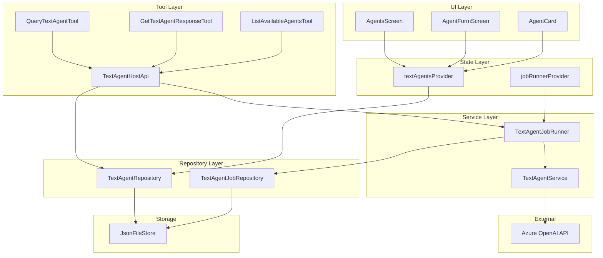
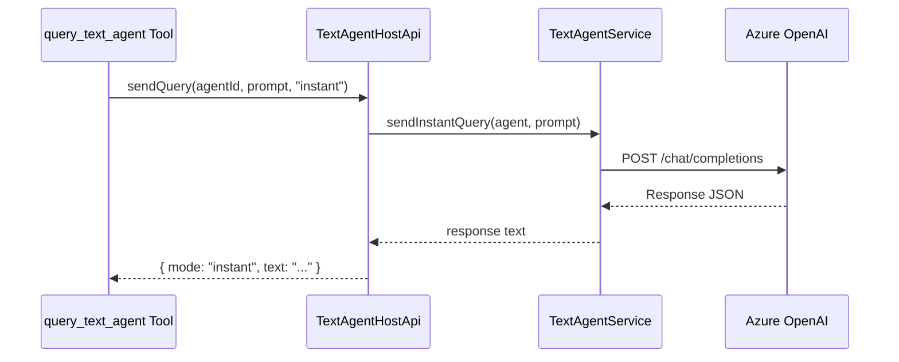
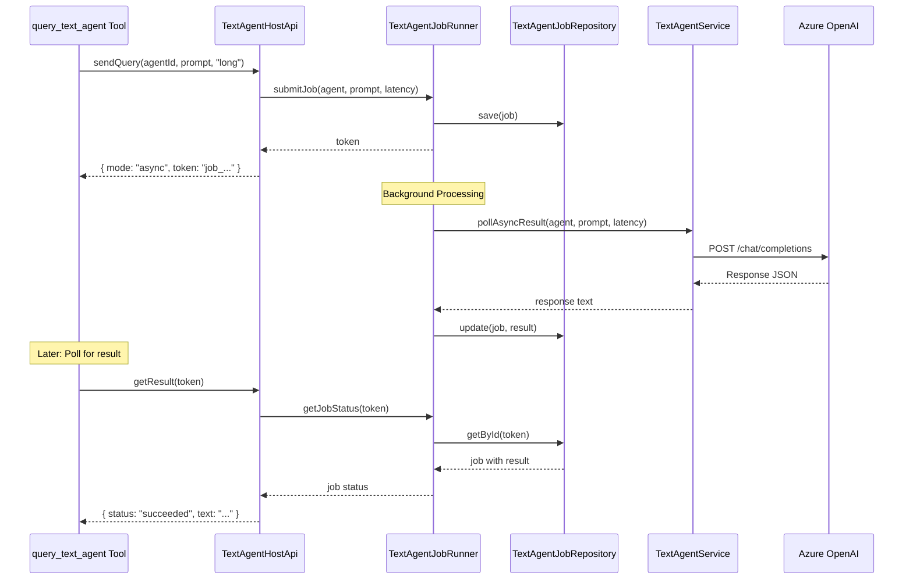

# Text Agent Architecture

## Overview

This document provides a technical overview of the text agent system architecture, designed for developers who need to understand, maintain, or extend the system.

## Table of Contents

1. [System Architecture](#system-architecture)
2. [Component Diagram](#component-diagram)
3. [Data Flow](#data-flow)
4. [Core Components](#core-components)
5. [API Reference](#api-reference)
6. [Extension Points](#extension-points)
7. [Testing Strategies](#testing-strategies)

## System Architecture

The text agent system follows a layered architecture with clear separation of concerns:

```
┌─────────────────────────────────────────────────────────┐
│                     UI Layer                            │
│  AgentsScreen, AgentFormScreen, AgentCard              │
└────────────────────┬────────────────────────────────────┘
                     │
┌────────────────────▼────────────────────────────────────┐
│                 State Management                         │
│  Riverpod Providers (textAgentsProvider, etc.)          │
└────────────────────┬────────────────────────────────────┘
                     │
┌────────────────────▼────────────────────────────────────┐
│                Service Layer                             │
│  TextAgentService, TextAgentJobRunner                   │
└────────┬───────────────────────────────────┬────────────┘
         │                                   │
┌────────▼──────────┐          ┌────────────▼────────────┐
│  Repository Layer │          │   Tool Runtime Layer    │
│  TextAgentRepo    │          │   Host APIs, Tools      │
│  JobRepo          │          └─────────────────────────┘
└────────┬──────────┘
         │
┌────────▼──────────┐
│  Storage Layer    │
│  JsonFileStore    │
└───────────────────┘
```

## Component Diagram



## Data Flow

### Instant Query Flow



### Async Query Flow (Long/Ultra-Long)



## Core Components

### 1. TextAgent Model

**Location**: `lib/feat/text_agents/model/text_agent.dart`

**Purpose**: Represents a configured text agent

```dart
class TextAgent {
  final String id;                    // Unique identifier
  final String name;                  // Display name
  final String? description;          // Optional description
  final AzureTextAgentConfig config;  // Azure OpenAI configuration
  final DateTime createdAt;           // Creation timestamp
  final DateTime updatedAt;           // Last update timestamp
}
```

**Key Features**:
- Immutable data class
- JSON serialization/deserialization
- `copyWith` method for updates

### 2. AzureTextAgentConfig

**Location**: `lib/feat/text_agents/model/azure_text_agent_config.dart`

**Purpose**: Stores Azure OpenAI-specific configuration

```dart
class AzureTextAgentConfig {
  final String endpoint;          // Azure OpenAI endpoint URL
  final String apiKey;            // API key (stored securely)
  final String apiVersion;        // API version (e.g., "2024-10-21")
  final String deploymentName;    // Deployment name
  final int? maxTokens;           // Maximum response tokens
  final double? temperature;      // Sampling temperature (0.0-2.0)
}
```

### 3. TextAgentJob Model

**Location**: `lib/feat/text_agents/model/text_agent_job.dart`

**Purpose**: Represents an async text agent job

```dart
class TextAgentJob {
  final String id;                      // Job ID (also used as token)
  final String agentId;                 // Which agent to use
  final String prompt;                  // User's query
  final TextAgentExpectLatency expectLatency;  // instant/long/ultra_long
  final TextAgentJobStatus status;      // pending/running/completed/failed/expired
  final DateTime createdAt;             // When job was created
  final DateTime expiresAt;             // When job expires
  final DateTime? completedAt;          // When job finished
  final String? result;                 // Result text (if completed)
  final String? error;                  // Error message (if failed)
}

enum TextAgentJobStatus {
  pending,    // Created, not yet started
  running,    // Currently processing
  completed,  // Successfully finished
  failed,     // Failed with error
  expired,    // Timed out
}

enum TextAgentExpectLatency {
  instant,     // < 30 seconds
  long,        // < 10 minutes
  ultraLong,   // < 1 hour
}
```

### 4. TextAgentService

**Location**: `lib/services/text_agent_service.dart`

**Purpose**: HTTP client for Azure OpenAI Chat Completions API

**Key Methods**:

```dart
class TextAgentService {
  // Send instant query (waits for response)
  Future<String> sendInstantQuery(
    TextAgent agent,
    String prompt, {
    Duration? timeout,
  });
  
  // Validate and prepare async query
  Future<String> sendAsyncQuery(
    TextAgent agent,
    String prompt,
    TextAgentExpectLatency latency,
  );
  
  // Execute async query (called by job runner)
  Future<String?> pollAsyncResult(
    TextAgent agent,
    String prompt,
    TextAgentExpectLatency latency,
  );
}
```

**Implementation Details**:
- Uses `http.Client` for requests
- Builds Azure OpenAI-compatible request bodies
- Handles response parsing
- Implements timeout and error handling
- Generates unique job tokens

### 5. TextAgentJobRunner

**Location**: `lib/services/text_agent_job_runner.dart`

**Purpose**: Manages background execution of async jobs

**Key Methods**:

```dart
class TextAgentJobRunner {
  // Initialize job runner (call on app startup)
  Future<void> initialize();
  
  // Submit a new async job
  Future<String> submitJob(
    TextAgent agent,
    String prompt,
    TextAgentExpectLatency latency,
  );
  
  // Get current job status
  Future<TextAgentJob?> getJobStatus(String jobId);
  
  // Process a specific job
  Future<void> processJob(String jobId);
  
  // Process all pending jobs
  Future<void> processAllPendingJobs();
  
  // Clean up expired jobs
  Future<void> cleanupExpiredJobs();
  
  // Dispose runner (stops background processing)
  void dispose();
}
```

**Features**:
- Periodic job processing (every 10 seconds)
- Retry logic with exponential backoff
- Job expiration handling
- Persists jobs across app restarts
- Concurrent job support

**Processing Algorithm**:

```dart
// Simplified processing loop
Timer.periodic(Duration(seconds: 10), (_) async {
  final jobs = await jobRepository.getPending();
  
  for (final job in jobs) {
    if (job.isExpired) {
      await markExpired(job);
      continue;
    }
    
    try {
      final result = await textAgentService.pollAsyncResult(
        agent, job.prompt, job.expectLatency
      );
      await markCompleted(job, result);
    } catch (e) {
      if (shouldRetry(job)) {
        await scheduleRetry(job);
      } else {
        await markFailed(job, e);
      }
    }
  }
});
```

### 6. Repository Layer

**TextAgentRepository Interface**: `lib/interfaces/text_agent_repository.dart`

```dart
abstract class TextAgentRepository {
  Future<void> save(TextAgent agent);
  Future<List<TextAgent>> getAll();
  Future<TextAgent?> getById(String id);
  Future<bool> update(TextAgent agent);
  Future<bool> delete(String id);
}
```

**TextAgentJobRepository Interface**: `lib/interfaces/text_agent_job_repository.dart`

```dart
abstract class TextAgentJobRepository {
  Future<void> save(TextAgentJob job);
  Future<List<TextAgentJob>> getAll();
  Future<TextAgentJob?> getById(String id);
  Future<void> delete(String id);
  Future<void> deleteExpired();
}
```

**JSON Implementations**:
- `JsonTextAgentRepository` - Stores agents in `vagina_config.json` under key `text_agents`
- `JsonTextAgentJobRepository` - Stores jobs under key `text_agent_jobs`

### 7. Tool Runtime Integration

**Host APIs**:

`lib/services/tools_runtime/host/text_agent_host_api.dart`:

```dart
class TextAgentHostApi {
  final TextAgentJobRunner _jobRunner;
  final TextAgentRepository _agentRepository;
  
  Future<Map<String, dynamic>> handleCall(
    String method,
    Map<String, dynamic> args,
  ) async {
    switch (method) {
      case 'sendQuery':
        return await _handleSendQuery(args);
      case 'getResult':
        return await _handleGetResult(args);
      case 'listAgents':
        return await _handleListAgents(args);
      default:
        return {'success': false, 'error': 'Unknown method'};
    }
  }
}
```

**Tool Implementations**:

All tools follow this pattern:

```dart
class QueryTextAgentTool extends Tool {
  @override
  ToolDefinition get definition => /* ... */;
  
  @override
  Future<void> init() async { /* ... */ }
  
  @override
  Future<String> execute(Map<String, dynamic> args) async {
    // 1. Validate parameters
    // 2. Call context API
    // 3. Return JSON result
  }
}
```

## API Reference

### TextAgentService API

#### sendInstantQuery

```dart
Future<String> sendInstantQuery(
  TextAgent agent,
  String prompt, {
  Duration? timeout,
})
```

**Parameters**:
- `agent`: The text agent to query
- `prompt`: User's query string
- `timeout`: Optional timeout (default: 30 seconds)

**Returns**: Response text from Azure OpenAI

**Throws**:
- `TimeoutException` - Request timed out
- `Exception` - Network or API errors

#### sendAsyncQuery

```dart
Future<String> sendAsyncQuery(
  TextAgent agent,
  String prompt,
  TextAgentExpectLatency latency,
)
```

**Parameters**:
- `agent`: The text agent to query
- `prompt`: User's query string
- `latency`: Expected latency tier

**Returns**: Job token string

**Throws**:
- `ArgumentError` - Invalid parameters

### TextAgentJobRunner API

#### submitJob

```dart
Future<String> submitJob(
  TextAgent agent,
  String prompt,
  TextAgentExpectLatency latency,
)
```

**Parameters**:
- `agent`: The text agent to use
- `prompt`: User's query
- `latency`: Latency mode

**Returns**: Job token for later retrieval

**Side Effects**:
- Creates job record in repository
- Triggers background processing

#### getJobStatus

```dart
Future<TextAgentJob?> getJobStatus(String jobId)
```

**Parameters**:
- `jobId`: The job token

**Returns**: Current job state or null if not found

### Azure OpenAI API Integration

**Endpoint**:
```
POST {endpoint}/openai/deployments/{deployment}/chat/completions?api-version={version}
```

**Request Headers**:
```
api-key: {apiKey}
Content-Type: application/json
```

**Request Body**:
```json
{
  "messages": [
    {"role": "user", "content": "{prompt}"}
  ],
  "max_tokens": 1000,
  "temperature": 0.7
}
```

**Response**:
```json
{
  "choices": [
    {
      "message": {
        "content": "The response text..."
      }
    }
  ]
}
```

## Extension Points

### Adding New Providers

To add support for OpenAI API or other providers:

1. Create provider-specific config class:
```dart
class OpenAITextAgentConfig {
  final String apiKey;
  final String model;
  final String? organization;
}
```

2. Update `TextAgent` model:
```dart
class TextAgent {
  final TextAgentProvider provider;  // enum: azure, openai
  final dynamic config;  // Union type or sealed class
}
```

3. Update `TextAgentService` to handle multiple providers:
```dart
Future<String> _sendRequest(TextAgent agent, String prompt) {
  switch (agent.provider) {
    case TextAgentProvider.azure:
      return _sendAzureRequest(agent.azureConfig, prompt);
    case TextAgentProvider.openai:
      return _sendOpenAIRequest(agent.openaiConfig, prompt);
  }
}
```

### Adding New Tools

To add a new text agent tool:

1. Create tool class implementing `Tool`:
```dart
class MyNewTool extends Tool {
  @override
  ToolDefinition get definition => /* ... */;
  
  
  
  @override
  Future<String> execute(Map<String, dynamic> args) async {
    final result = await context.textAgentApi.myNewMethod(args);
    return jsonEncode(result);
  }
}
```

2. Add method to `TextAgentApi`:
```dart
abstract class TextAgentApi {
  Future<Map<String, dynamic>> myNewMethod(Map<String, dynamic> args);
}
```

3. Implement in `TextAgentHostApi`:
```dart
Future<Map<String, dynamic>> _handleMyNewMethod(args) async {
  // Implementation
}
```

4. Register in `BuiltinToolCatalog`:
```dart
case 'my_new_tool':
  return MyNewTool();
```

### Custom Job Prioritization

To implement job prioritization:

```dart
class PriorityTextAgentJobRunner extends TextAgentJobRunner {
  @override
  Future<void> processAllPendingJobs() async {
    final jobs = await jobRepository.getAll();
    final pending = jobs.where((j) => j.status == pending);
    
    // Sort by priority (add priority field to TextAgentJob)
    final sorted = pending.toList()
      ..sort((a, b) => b.priority.compareTo(a.priority));
    
    for (final job in sorted) {
      await processJob(job.id);
    }
  }
}
```

### Streaming Responses

To add streaming support for instant queries:

```dart
Stream<String> sendInstantQueryStream(
  TextAgent agent,
  String prompt,
) async* {
  final request = await _buildRequest(agent, prompt);
  request.headers['Accept'] = 'text/event-stream';
  
  final response = await _httpClient.send(request);
  
  await for (final chunk in response.stream.transform(utf8.decoder)) {
    // Parse SSE format
    if (chunk.startsWith('data: ')) {
      final data = chunk.substring(6);
      final json = jsonDecode(data);
      final delta = json['choices'][0]['delta']['content'];
      if (delta != null) {
        yield delta;
      }
    }
  }
}
```

## Testing Strategies

### Unit Testing

**Test Services in Isolation**:

```dart
test('sendInstantQuery returns response', () async {
  final mockClient = MockClient((request) async {
    return http.Response(
      jsonEncode({
        'choices': [{'message': {'content': 'Test response'}}]
      }),
      200,
    );
  });
  
  final service = TextAgentService(httpClient: mockClient);
  final result = await service.sendInstantQuery(testAgent, 'prompt');
  
  expect(result, equals('Test response'));
});
```

**Test Job Runner Logic**:

```dart
test('submitJob creates job and returns token', () async {
  final mockRepo = MockTextAgentJobRepository();
  final runner = TextAgentJobRunner(jobRepository: mockRepo, /* ... */);
  
  final token = await runner.submitJob(testAgent, 'prompt', long);
  
  expect(token, startsWith('job_'));
  verify(mockRepo.save(any)).called(1);
});
```

### Integration Testing

**Test Complete Workflows**:

```dart
test('instant query end-to-end', () async {
  // Setup real repositories with in-memory store
  final store = MockKeyValueStore();
  final agentRepo = JsonTextAgentRepository(store);
  final service = TextAgentService(httpClient: mockClient);
  
  // Create agent
  await agentRepo.save(testAgent);
  
  // Execute query
  final result = await service.sendInstantQuery(testAgent, 'test');
  
  expect(result, isNotEmpty);
});
```

### Tool Testing

**Test Tool Execution**:

```dart
test('query_text_agent tool executes successfully', () async {
  final tool = QueryTextAgentTool();
  final mockContext = MockToolContext();
  
  await tool.init();
  final result = await tool.execute({
    'agent_id': 'test_id',
    'prompt': 'test',
    'expect_latency': 'instant',
  }, mockContext);
  
  final data = jsonDecode(result);
  expect(data['success'], isTrue);
});
```

### Performance Testing

**Measure Job Processing Time**:

```dart
test('job processes within expected time', () async {
  final stopwatch = Stopwatch()..start();
  
  final token = await runner.submitJob(agent, prompt, long);
  await runner.processJob(token);
  
  stopwatch.stop();
  expect(stopwatch.elapsed.inSeconds, lessThan(60));
});
```

## Performance Considerations

### Memory Management

- Jobs are loaded on-demand, not kept in memory
- Completed jobs can be cleaned up after retrieval
- Use pagination for large agent lists

### Network Optimization

- Reuse HTTP client instances
- Implement request batching for multiple queries
- Cache agent configurations

### Background Processing

- Job runner uses periodic timer (10 seconds)
- Processes one job at a time to avoid overwhelming API
- Can be configured for concurrent processing

### Database Performance

- JSON file storage is acceptable for < 100 agents
- For larger scale, consider SQLite or remote database
- Index jobs by status for efficient querying

## Security Considerations

### API Key Storage

- Currently stored in JSON (local device only)
- Future: Migrate to secure storage (Keychain/Keystore)
- Never log or display API keys

### Input Validation

- Always validate tool parameters
- Sanitize user input before sending to API
- Limit prompt length to prevent abuse

### Error Handling

- Don't expose internal errors to voice agent
- Log detailed errors securely
- Return user-friendly error messages

## Troubleshooting

### Job Stuck in Pending

**Symptoms**: Job never transitions to running

**Causes**:
- Job runner not initialized
- Agent deleted
- Repository errors

**Solution**:
```dart
await runner.initialize();
await runner.processAllPendingJobs();
```

### High API Costs

**Symptoms**: Unexpected Azure bills

**Causes**:
- Large max_tokens settings
- Too many retries
- Expensive model (gpt-4o vs gpt-4o-mini)

**Solution**:
- Set reasonable token limits
- Reduce retry attempts
- Use cheaper models where appropriate

## Code Examples

### Creating an Agent Programmatically

```dart
final agent = TextAgent(
  id: 'custom_agent_${DateTime.now().millisecondsSinceEpoch}',
  name: 'Custom Agent',
  description: 'Created programmatically',
  config: AzureTextAgentConfig(
    endpoint: 'https://my-resource.openai.azure.com',
    apiKey: 'my-key',
    apiVersion: '2024-10-21',
    deploymentName: 'gpt-4o-mini',
    maxTokens: 1500,
    temperature: 0.5,
  ),
  createdAt: DateTime.now(),
  updatedAt: DateTime.now(),
);

await textAgentRepository.save(agent);
```

### Querying an Agent

```dart
// Instant query
final response = await textAgentService.sendInstantQuery(
  agent,
  'What is the capital of France?',
  timeout: Duration(seconds: 20),
);
print(response); // "The capital of France is Paris."

// Async query
final token = await jobRunner.submitJob(
  agent,
  'Write a detailed analysis of market trends',
  TextAgentExpectLatency.long,
);

// Poll for results
while (true) {
  final job = await jobRunner.getJobStatus(token);
  if (job?.status == TextAgentJobStatus.completed) {
    print(job!.result);
    break;
  }
  await Future.delayed(Duration(seconds: 5));
}
```

## Related Documentation

- [User Guide](../features/text_agents.md)
- [Voice Agent Tools](../features/voice_agent_tools.md)
- [API Reference](../api/text_agent_api.md)
- [Tool Development](tool_development.md)

---

**Last Updated**: 2026-01-18  
**Version**: 1.0.0
