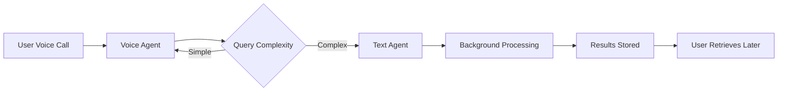

# Text Agents User Guide

## Overview

Text Agents are specialized AI assistants that can handle text-based queries and perform deep reasoning tasks. Unlike voice agents that provide real-time spoken conversation, text agents excel at:

- **Deep analysis and research** - Complex reasoning that requires more time
- **Long-form content generation** - Reports, articles, summaries
- **Specialized knowledge tasks** - Domain-specific expertise
- **Background processing** - Tasks that continue even after ending a voice call

Text agents can be accessed both directly through the Agents tab and indirectly through voice agents using the new voice agent tools.

## Key Features

### Three Latency Modes

Text agents support three different latency modes to match your task requirements:

1. **Instant** (< 30 seconds)
   - Quick fact-checking
   - Simple questions
   - Short responses
   - Returns result immediately

2. **Long** (up to 10 minutes)
   - Detailed analysis
   - Medium-length content
   - Multiple reasoning steps
   - Returns a job token, poll for results

3. **Ultra Long** (up to 1 hour)
   - Comprehensive research
   - Long-form writing
   - Complex multi-step tasks
   - Returns a job token, poll for results

### Persistent Background Jobs

When you submit a long or ultra-long task:
- You receive a **job token** immediately
- The task continues processing in the background
- You can end your voice call and come back later
- Results are saved and retrievable with the token
- Jobs persist across app restarts

## Getting Started

### Creating Your First Text Agent

1. **Open the Agents Tab**
   - Navigate to the home screen
   - Tap on the "エージェント" (Agents) tab at the bottom

2. **Add a New Agent**
   - Tap the "+" button in the top-right corner
   - Fill in the agent details:
     - **Name**: Give your agent a descriptive name (e.g., "Research Helper")
     - **Description** (optional): Brief description of the agent's purpose
     - **Specialization** (optional): What this agent is good at

3. **Configure Azure OpenAI Settings**
   - **Endpoint**: Your Azure OpenAI resource endpoint
     - Format: `https://YOUR-RESOURCE.openai.azure.com`
   - **API Key**: Your Azure OpenAI API key
     - Find this in the Azure Portal under your resource
   - **API Version**: API version (default: `2024-10-21`)
   - **Deployment Name**: The name of your GPT deployment
     - Examples: `gpt-4o-mini`, `gpt-4o`, `gpt-35-turbo`

4. **Advanced Settings** (Optional)
   - **System Prompt**: Custom instructions for the agent
   - **Max Tokens**: Maximum response length (default: 1000)
   - **Temperature**: Creativity level 0.0-2.0 (default: 0.7)
     - Lower = more focused and deterministic
     - Higher = more creative and varied

5. **Save**
   - Tap "保存" (Save) to create the agent

### Example Agent Configuration

```yaml
Name: Market Research Assistant
Description: Specializes in market analysis and competitive research
Specialization: Market Research

Azure Configuration:
  Endpoint: https://my-company.openai.azure.com
  API Key: ********************************
  API Version: 2024-10-21
  Deployment: gpt-4o-mini
  
Advanced Settings:
  System Prompt: "You are an expert market research analyst. Provide detailed,
                  data-driven insights with citations when possible."
  Max Tokens: 2000
  Temperature: 0.3
```

## Using Text Agents

### From Voice Calls

During a voice call, your voice agent can use text agents for deeper analysis:

**Example Conversation:**

```
You: "Can you analyze the current state of the EV market?"

Voice Agent: "I'll query my research assistant for a detailed analysis. 
              This will take a few minutes..."

[Voice agent uses query_text_agent tool with "long" latency]

Voice Agent: "I've submitted the research task. You can end this call and 
              I'll notify you when the analysis is ready."

[Later, when checking results]

Voice Agent: "The market analysis is complete. Here are the key findings..."
```

### Direct Management

From the Agents tab, you can:

- **View all agents**: See your configured text agents
- **Edit agents**: Update configuration or specialization
- **Delete agents**: Remove agents you no longer need
- **Select default agent**: Choose which agent voice calls use by default

### Job Management

When you submit a long or ultra-long query:

1. **Receive Job Token**: Example: `job_1705612345678_1234`
2. **Job Processes in Background**: Continue your work
3. **Check Job Status**: Use the `get_text_agent_response` tool
4. **Retrieve Results**: Once complete, get the full response

## Best Practices

### Choosing the Right Latency Mode

**Use Instant when:**
- Asking factual questions
- Getting quick definitions
- Simple calculations
- Short summaries

**Use Long when:**
- Analyzing documents
- Generating medium-length content
- Comparing multiple options
- Detailed explanations

**Use Ultra Long when:**
- Writing comprehensive reports
- Complex research tasks
- Multi-step analysis
- Tasks requiring extensive reasoning

### Writing Effective Prompts

**Be Specific:**
```
❌ Bad: "Tell me about AI"
✅ Good: "Explain the key differences between supervised and unsupervised 
         machine learning, with examples of each"
```

**Provide Context:**
```
✅ "I'm a software developer new to cloud architecture. Explain the benefits
    of microservices vs monolithic architecture in simple terms."
```

**Set Expectations:**
```
✅ "Write a 500-word blog post introduction about renewable energy, targeting
    non-technical readers."
```

### Managing API Costs

Text agents use Azure OpenAI, which charges per token:

1. **Use Appropriate Models**
   - `gpt-4o-mini`: Cost-effective for most tasks
   - `gpt-4o`: Higher capability for complex reasoning

2. **Set Max Token Limits**
   - Prevents unexpectedly long (expensive) responses
   - Recommended: 1000-2000 for most tasks

3. **Monitor Usage**
   - Check your Azure Portal for usage metrics
   - Set up billing alerts

## Common Use Cases

### 1. Research During Meetings

**Scenario**: During a voice call, you need detailed competitive analysis

```
Voice Agent: "Should we enter the renewable energy market?"
Text Agent (ultra_long): Analyzes market size, competitors, barriers to entry,
                         and provides comprehensive recommendation
Voice Call Ends: You receive results later via notification
```

### 2. Content Creation

**Scenario**: Generate marketing content

```
Query (long): "Write 3 different email subject lines and body copy for our 
              new product launch, targeting small business owners"
Result: Returns multiple options with A/B testing recommendations
```

### 3. Technical Assistance

**Scenario**: Debug code or explain technical concepts

```
Query (instant): "Explain this error: TypeError: Cannot read property 'length' 
                 of undefined"
Result: Immediate explanation with common causes and fixes
```

### 4. Document Analysis

**Scenario**: Summarize long documents

```
Query (long): "Summarize this 50-page report focusing on key findings,
              methodology concerns, and actionable recommendations"
Result: Structured summary ready in minutes
```

## Troubleshooting

### "Agent not found" Error

**Cause**: The agent was deleted or ID is incorrect
**Solution**: Check that the agent still exists in the Agents tab

### "API Key Invalid" Error

**Cause**: Incorrect or expired API key
**Solution**: 
1. Go to Azure Portal
2. Navigate to your OpenAI resource
3. Copy the current API key
4. Update agent configuration

### "Job Expired" Error

**Cause**: Job took too long or wasn't retrieved in time
**Solution**: 
- Long jobs expire after 1 hour
- Ultra-long jobs expire after 24 hours
- Resubmit the query if needed

### "Timeout" Error

**Cause**: The query took longer than expected
**Solution**:
- Use a higher latency mode (instant → long → ultra_long)
- Break complex queries into smaller parts
- Check Azure service health

### Agent Not Responding

**Checklist**:
- [ ] Verify Azure OpenAI endpoint is correct
- [ ] Confirm API key is valid
- [ ] Check deployment name matches your Azure resource
- [ ] Ensure API version is supported
- [ ] Verify you have quota remaining in Azure

## Advanced Features

### Multiple Specialized Agents

Create different agents for different purposes:

```
Agent 1: "Code Review Assistant"
  - Specialization: Code analysis
  - Model: gpt-4o
  - Temperature: 0.2 (focused)

Agent 2: "Creative Writer"
  - Specialization: Content creation
  - Model: gpt-4o
  - Temperature: 0.9 (creative)

Agent 3: "Quick Facts"
  - Specialization: Fast lookups
  - Model: gpt-4o-mini
  - Temperature: 0.0 (deterministic)
```

### Custom System Prompts

Tailor agent behavior with system prompts:

**For Technical Documentation:**
```
You are a technical writer. Write clear, concise documentation with code
examples. Use markdown formatting. Always include a "Common Pitfalls" section.
```

**For Business Analysis:**
```
You are a business analyst with MBA-level expertise. Provide data-driven
insights with specific numbers when possible. Structure responses with:
1. Executive Summary
2. Detailed Analysis
3. Recommendations
4. Next Steps
```

### Integration with Voice Agents

Voice agents automatically access text agents through tools:



## Security & Privacy

### API Key Storage

- API keys are stored locally on your device
- Keys are not transmitted except to Azure OpenAI
- Consider using Azure Key Vault for enhanced security

### Data Privacy

- Queries are sent to Azure OpenAI
- Microsoft's data usage policies apply
- See: [Azure OpenAI Data Privacy](https://azure.microsoft.com/en-us/support/legal/)

### Best Practices

1. **Never share API keys** with others
2. **Use separate keys** for different environments (dev/prod)
3. **Rotate keys regularly** (every 90 days recommended)
4. **Monitor usage** for unexpected activity
5. **Set spending limits** in Azure to prevent cost overruns

## Frequently Asked Questions

**Q: Can I use text agents without Azure OpenAI?**
A: Currently, only Azure OpenAI is supported. OpenAI API support may be added in future versions.

**Q: What happens to jobs if I close the app?**
A: Jobs continue processing in Azure. When you reopen the app, you can retrieve results using the job token.

**Q: Can I cancel a running job?**
A: Currently, jobs cannot be cancelled. They will complete or expire based on the latency mode.

**Q: How many agents can I create?**
A: There's no hard limit, but managing 3-5 specialized agents is typically sufficient.

**Q: Can text agents see my voice call history?**
A: No, each query is independent. Agents don't have access to call history unless you include it in your prompt.

**Q: What's the difference between text agents and voice agents (speed dials)?**
A: Voice agents provide real-time spoken conversation. Text agents provide written responses and can handle much longer, more complex tasks.

## Next Steps

- [Voice Agent Tools Documentation](voice_agent_tools.md) - Learn how voice agents use text agents
- [API Reference](../api/text_agent_api.md) - Technical API documentation
- [Architecture Guide](../development/text_agent_architecture.md) - For developers

## Support

For issues or questions:
1. Check the [Troubleshooting](#troubleshooting) section
2. Review [Azure OpenAI Documentation](https://learn.microsoft.com/en-us/azure/ai-services/openai/)
3. Check application logs in Settings > Developer > View Logs
4. Report bugs through the project's GitHub Issues

---

**Last Updated**: 2026-01-18  
**Version**: 1.0.0
