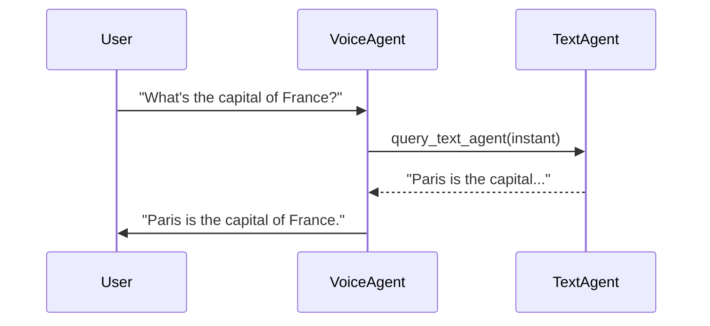
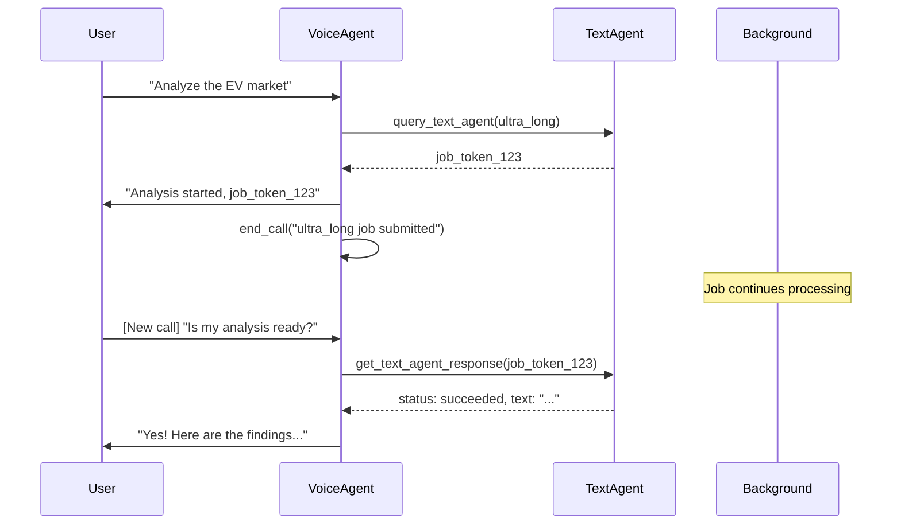
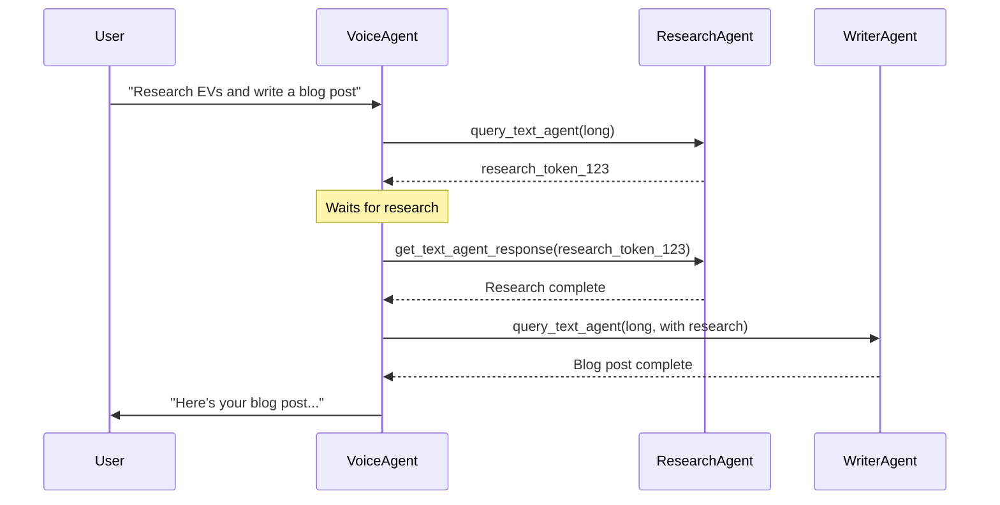

# Voice Agent Tools Documentation

## Overview

Voice agents in VAGINA have been enhanced with four new powerful tools that enable them to control calls and query text-based AI assistants for deeper analysis. These tools extend voice agents' capabilities beyond real-time conversation.

## The Four New Tools

### 1. `end_call` - Programmatic Call Control

**Purpose**: Allows the voice agent to end the current call programmatically

**When to Use**:
- Natural conversation conclusion
- After submitting a long-running task
- When the user explicitly requests to end
- When transitioning from voice to background processing

**Parameters**:
- `end_context` (optional, string): Context about why the call is ending

**Returns**:
```json
{
  "success": true,
  "ended": true
}
```

**Example Usage Scenario**:
```
User: "Thanks, that's all I needed. Goodbye!"
Voice Agent: "You're welcome! Have a great day!"
[Voice Agent calls end_call tool]
[Call ends gracefully]
```

---

### 2. `query_text_agent` - Delegate to Text Agents

**Purpose**: Send queries to specialized text AI agents for deep reasoning

**When to Use**:
- Complex analysis beyond real-time conversation
- Research requiring multiple sources
- Long-form content generation
- Tasks that might take several minutes

**Parameters**:
- `agent_id` (required, string): ID of the text agent to query
- `prompt` (required, string): The query or task description
- `expect_latency` (required, enum): Expected response time
  - `"instant"`: < 30 seconds, returns result immediately
  - `"long"`: < 10 minutes, returns job token
  - `"ultra_long"`: < 1 hour, returns job token

**Returns for Instant**:
```json
{
  "success": true,
  "mode": "instant",
  "text": "The response content...",
  "agent_id": "agent_123"
}
```

**Returns for Long/Ultra-Long**:
```json
{
  "success": true,
  "mode": "async",
  "token": "job_1705612345678_1234",
  "agent_id": "agent_123",
  "poll_after_ms": 1500
}
```

**Example Usage Scenarios**:

**Instant Query**:
```
User: "What's the chemical formula for table salt?"
Voice Agent: [calls query_text_agent with expect_latency="instant"]
Voice Agent: "Table salt is sodium chloride, with the chemical formula NaCl."
```

**Long Query with Background Processing**:
```
User: "Can you write a detailed market analysis for electric vehicles?"
Voice Agent: [calls query_text_agent with expect_latency="ultra_long"]
Voice Agent: "I've started a comprehensive analysis. This will take about 
              30 minutes. I'll save the results so you can access them later."
Voice Agent: [calls end_call with context="ultra_long market analysis in progress"]
[Call ends, job continues in background]
```

---

### 3. `get_text_agent_response` - Retrieve Async Results

**Purpose**: Check status and retrieve results from previously submitted text agent jobs

**When to Use**:
- Polling for long/ultra-long query results
- Checking job status
- Retrieving completed analyses

**Parameters**:
- `token` (required, string): The job token from `query_text_agent`

**Returns - Still Processing**:
```json
{
  "success": true,
  "status": "running",
  "poll_after_ms": 1500
}
```

**Returns - Completed**:
```json
{
  "success": true,
  "status": "succeeded",
  "text": "The complete analysis results..."
}
```

**Returns - Failed**:
```json
{
  "success": false,
  "status": "failed",
  "error": "Error description..."
}
```

**Returns - Expired**:
```json
{
  "success": false,
  "status": "expired",
  "error": "Job expired after timeout"
}
```

**Example Usage Scenario**:
```
[Later call or new call]
User: "Did that market analysis finish?"
Voice Agent: [calls get_text_agent_response with saved token]
Voice Agent: "Yes! Here are the key findings..."
[Reads summary from the response]
```

---

### 4. `list_available_agents` - Discover Text Agents

**Purpose**: Get information about all configured text agents

**When to Use**:
- Determining which agent to query
- Finding specialized agents for specific tasks
- Presenting options to the user

**Parameters**: None

**Returns**:
```json
{
  "success": true,
  "agents": [
    {
      "id": "agent_1",
      "name": "Research Assistant",
      "description": "Specializes in research and analysis",
      "specialization": "Research",
      "provider": "azureOpenAI",
      "model_or_deployment": "gpt-4o-mini"
    },
    {
      "id": "agent_2",
      "name": "Creative Writer",
      "description": "Helps with creative writing",
      "specialization": "Writing",
      "provider": "azureOpenAI",
      "model_or_deployment": "gpt-4o"
    }
  ]
}
```

**Example Usage Scenario**:
```
User: "What text agents do I have available?"
Voice Agent: [calls list_available_agents]
Voice Agent: "You have 3 text agents configured:
              1. Research Assistant - for analysis and research
              2. Creative Writer - for content creation
              3. Quick Facts - for fast lookups"
```

## Complete Workflow Examples

### Example 1: Quick Fact Check During Call



**Conversation**:
```
User: "What's the capital of France?"
Voice Agent: [Calls query_text_agent with instant latency]
Voice Agent: "The capital of France is Paris."
```

---

### Example 2: Long Analysis with Call End



**First Conversation**:
```
User: "Can you do a comprehensive market analysis for electric vehicles?"

Voice Agent: [Calls list_available_agents]
Voice Agent: [Finds Research Assistant]
Voice Agent: "I'll use the Research Assistant for this. It will take about 
              30-45 minutes."

Voice Agent: [Calls query_text_agent with ultra_long]
Voice Agent: "I've started the analysis. The job token is job_abc123. 
              I'll end this call so the analysis can continue in the 
              background."

Voice Agent: [Calls end_call with context "ultra_long EV market analysis"]
[Call ends]
```

**Second Conversation (45 minutes later)**:
```
User: "Is my EV market analysis ready?"

Voice Agent: [Calls get_text_agent_response with job_abc123]
Voice Agent: "Yes, it's complete! Here's the executive summary: 
              The electric vehicle market is projected to grow at 28% CAGR..."
              [Continues with key findings]

User: "Can you send me the full report?"
Voice Agent: "I can save it to your notepad. Would you like that?"
```

---

### Example 3: Multi-Agent Collaboration



**Conversation**:
```
User: "I need to write a blog post about electric vehicles. Can you research 
       the topic and then write a draft?"

Voice Agent: [Calls list_available_agents]
Voice Agent: "I'll use the Research Assistant first, then the Creative Writer. 
              This will take about 15 minutes total."

Voice Agent: [Calls query_text_agent on Research Agent with "long"]
Voice Agent: "Starting research phase..."

[Waits and polls]

Voice Agent: [Gets research results]
Voice Agent: "Research complete. Now generating the blog post..."

Voice Agent: [Calls query_text_agent on Writer Agent with research context]
Voice Agent: [Gets blog post]
Voice Agent: "Your blog post is ready! I'll read you the introduction..."
```

## Tool Combination Patterns

### Pattern 1: Instant Query → Continue Call

**Use Case**: Quick information lookup during conversation

```python
# Pseudo-code
answer = query_text_agent(agent_id, prompt, "instant")
# Voice agent speaks the answer
# Call continues
```

### Pattern 2: Long Query → End Call

**Use Case**: Complex task that takes time

```python
# Pseudo-code
token = query_text_agent(agent_id, prompt, "ultra_long")
# Voice agent informs user
end_call(f"ultra_long task {token} in progress")
# User can check results later
```

### Pattern 3: Query → Poll → Report

**Use Case**: Wait for results during the same call

```python
# Pseudo-code
token = query_text_agent(agent_id, prompt, "long")
# Voice agent says "One moment, analyzing..."
while True:
    result = get_text_agent_response(token)
    if result.status == "succeeded":
        # Voice agent reports results
        break
    # Wait before polling again
```

### Pattern 4: List → Select → Query

**Use Case**: Choose the best agent for the task

```python
# Pseudo-code
agents = list_available_agents()
# Voice agent determines which agent is best
selected_agent = find_best_agent(agents, task_type)
result = query_text_agent(selected_agent.id, prompt, latency)
```

## Best Practices for Voice Agents

### 1. Always Inform the User

```
❌ Bad: [Silently calls tool and waits]

✅ Good: "Let me check that for you..."
         [Calls tool]
         "According to my research assistant..."
```

### 2. Handle Latency Appropriately

```
For instant queries:
  "Let me look that up... [calls tool] ... Here's what I found..."

For long queries:
  "This analysis will take about 10 minutes. I'll start it now and 
   you can check back later."

For ultra-long queries:
  "This comprehensive research will take 30-45 minutes. I recommend
   ending this call while it processes in the background."
```

### 3. Provide Meaningful Context for end_call

```
❌ Bad: end_call(null)

✅ Good: end_call("natural conclusion after answering all questions")
✅ Good: end_call("ultra_long market analysis job submitted")
✅ Good: end_call("user requested to end call")
```

### 4. Error Handling

```
Always check success field:

if result.success:
    # Use the result
else:
    # Inform user of the error
    "I'm sorry, I encountered an error: {result.error}"
```

### 5. Token Management

```
Save tokens for user reference:
- Store in memory tool for later retrieval
- Include in call summary
- Provide to user verbally
```

## Error Scenarios and Handling

### Agent Not Found

```json
{
  "success": false,
  "error": "Agent not found: agent_xyz"
}
```

**Voice Agent Response**: "I'm sorry, that text agent doesn't exist. Let me check what agents are available..."

### Invalid Latency Mode

```json
{
  "success": false,
  "error": "Invalid expect_latency value. Must be one of: instant, long, ultra_long"
}
```

**Voice Agent Response**: "I made an error in my request. Let me try again..."

### Job Token Expired

```json
{
  "success": false,
  "status": "expired",
  "error": "Job expired after timeout"
}
```

**Voice Agent Response**: "That job took too long and expired. Would you like me to resubmit it?"

### Network Error

```json
{
  "success": false,
  "error": "Network error: connection timeout"
}
```

**Voice Agent Response**: "I'm having trouble connecting to the text agent. Let me try again, or we can continue without it."

## Advanced Integration Scenarios

### Scenario: Multi-Step Research Task

```
1. User asks complex question
2. Voice agent lists available agents
3. Selects research agent
4. Submits ultra_long query
5. Saves token to memory
6. Informs user about timeline
7. Ends call with context
8. User calls back later
9. Voice agent recalls token from memory
10. Polls for results
11. Presents findings
```

### Scenario: Comparative Analysis

```
1. User wants to compare multiple options
2. Voice agent queries text agent for each option (instant)
3. Collates responses
4. Presents comparison verbally
5. Offers to write detailed report (long query)
6. If accepted, submits report generation
7. Notifies user when complete
```

### Scenario: Interactive Research

```
1. User provides broad topic
2. Voice agent queries for overview (instant)
3. Presents key areas
4. User selects area for deep dive
5. Voice agent submits detailed analysis (long)
6. Continues conversation on other topics
7. Polls periodically
8. When ready, presents detailed findings
```

## Tool Categories and Icons

These tools appear in the Tools tab with the following categories:

- **end_call**
  - Category: `call`
  - Icon: `call_end`
  - Display Name: 通話終了 (Call End)

- **query_text_agent**
  - Category: `text_agent`
  - Icon: `chat`
  - Display Name: テキストエージェントクエリ (Text Agent Query)

- **get_text_agent_response**
  - Category: `text_agent`
  - Icon: `download`
  - Display Name: テキストエージェントレスポンス取得 (Get Text Agent Response)

- **list_available_agents**
  - Category: `text_agent`
  - Icon: `list`
  - Display Name: 利用可能エージェント一覧 (List Available Agents)

## Configuration

These tools are built-in and automatically available to all voice agents. They can be toggled on/off in the Tools tab if needed.

## Performance Considerations

### Latency Guidelines

- **Instant**: Use for queries that should complete in < 30 seconds
- **Long**: Use for queries taking 30 seconds to 10 minutes
- **Ultra-Long**: Use for queries requiring 10-60 minutes

### Token Persistence

- Instant queries: No token, immediate result
- Long queries: Token expires after 1 hour
- Ultra-long queries: Token expires after 24 hours

### Concurrent Jobs

- Voice agents can submit multiple text agent jobs
- Jobs process independently
- Each job has its own token
- Results are retrieved separately

## Security and Privacy

### API Key Security

- Text agent API keys are stored locally
- Not transmitted during tool calls
- Only used for Azure OpenAI communication

### Call Context

- The `end_context` parameter is saved with the call session
- Can be used to resume context in future calls
- Should not contain sensitive information

## Debugging

### Enable Tool Call Logging

In Settings > Developer:
- Enable "Show Tool Calls in Chat"
- View detailed tool execution logs

### Common Issues

**Tool not appearing**:
- Check Tools tab
- Ensure tool is enabled
- Restart app

**Query failing**:
- Verify text agent configuration
- Check Azure API key
- Ensure deployment exists

**Job not completing**:
- Check job status with get_text_agent_response
- Verify latency mode is appropriate
- Check Azure service health

## Related Documentation

- [Text Agents User Guide](text_agents.md) - Learn about text agents
- [API Reference](../api/text_agent_api.md) - Technical API details
- [Tool Development Guide](../development/tool_development.md) - Creating custom tools

---

**Last Updated**: 2026-01-18  
**Version**: 1.0.0
