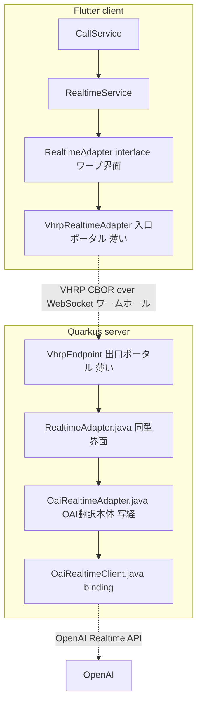
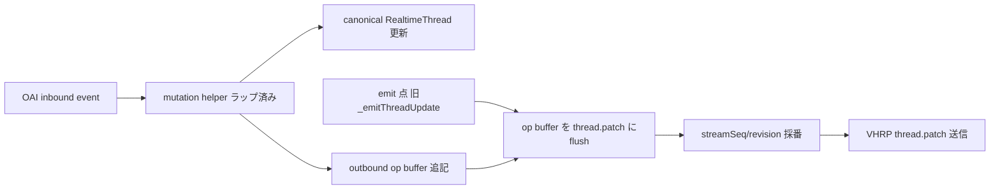
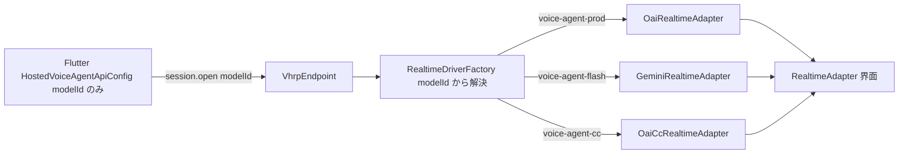
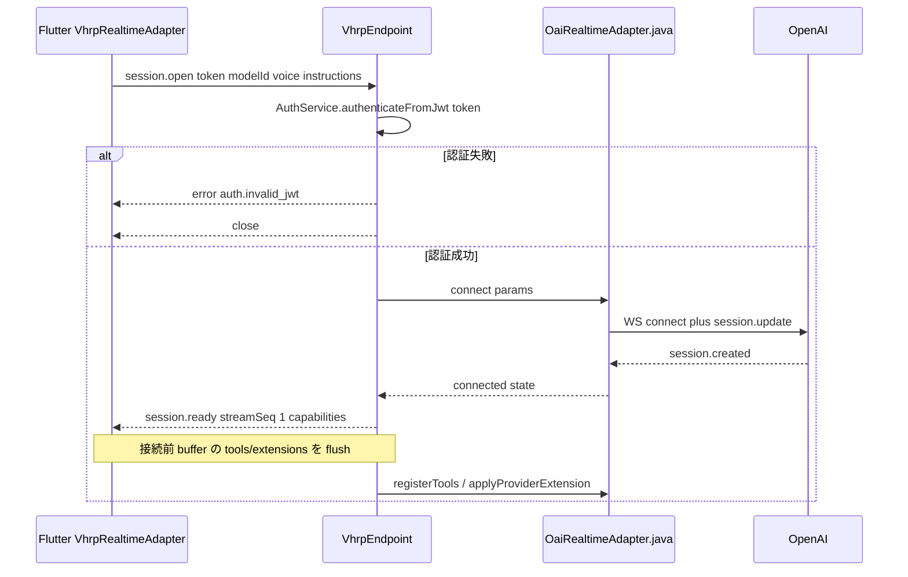
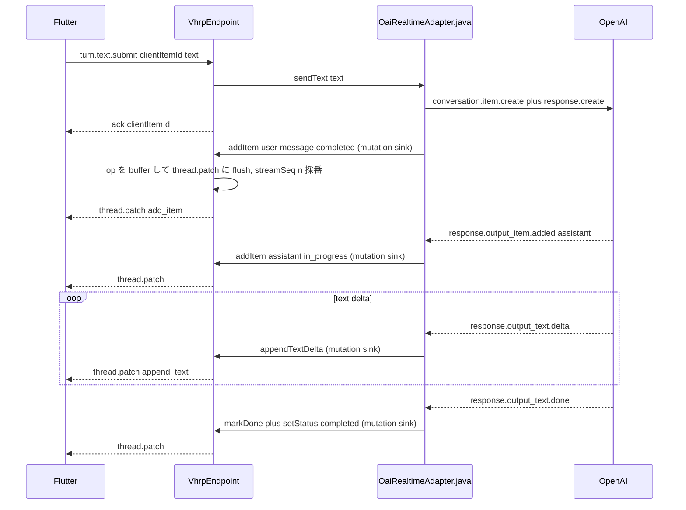
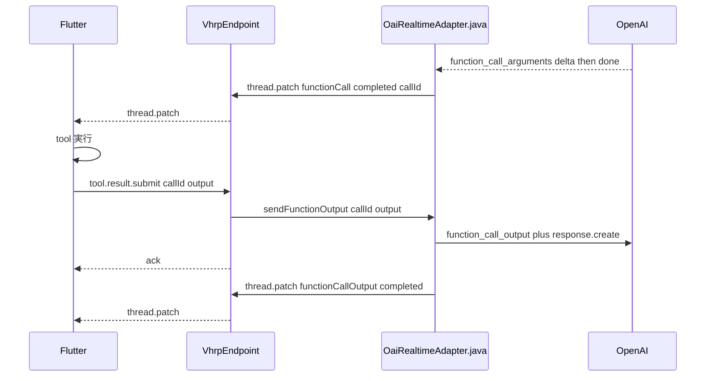
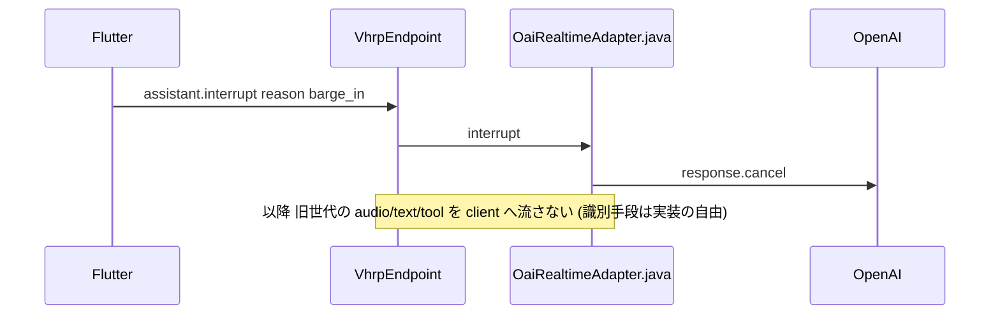

# Quarkus Backend Spec

## この文書の位置づけ

[01_adapter_boundary.md](./01_adapter_boundary.md) と [02_vhrp_wire_protocol.md](./02_vhrp_wire_protocol.md) を前提に、VHRP/1 の **server 側実装方針** を定める。実装に入る前のクリーンルーム設計であり、責務分割・パッケージ構造・クラス関係・主要シーケンスを確定させることが目的である。

## 中核となる設計判断

この設計は、ユーザとの対話で確定した複数の設計判断の上に立つ。中核は以下の判断1〜5 + 判断(音声リレー)であり、判断6 以降は後続の各セクションで個別に導入する。

### 判断1: ワープ界面は `RealtimeAdapter` interface である

standalone 実装である [`OaiRealtimeAdapter`](../../lib/feat/call/services/realtime/oai/realtime_adapter.dart) は 2 つの顔を持つ。

- **上面**: `implements RealtimeAdapter`。10 系統の能力と `RealtimeThread` の見え方。外向きのポータルの口。
- **下面**: OAI event を `RealtimeThread` に投影し、契約を OAI command へ翻訳する vendor translation 本体。

VHRP 化とは、この 1 枚のクラスを界面で割り、**下面をインターネットの向こう（Quarkus）へ移送する**操作である。



### 判断2: レイヤードではなく Dart パッケージの逐語ミラー

既存サーバの `resource -> usecase -> service` 三層規約は、この機能には最適でない。代わりに **Dart の `realtime/` パッケージ構造を Java へ逐語ミラーする**。理由は、standalone OAI 実装をほぼそのまま写経でき、ワープ界面の同型性がコードレベルで保証されるからである。

VHRP エンドポイントは、このミラー界面を **駆動する薄いプロキシ** に徹する。usecase/service 層は介在させない。

### 判断3: 非同期プリミティブは Mutiny

Quarkus/Vert.x のイベントループと自然に噛み合い、`quarkus-websockets-next` とも相性が良いため、Dart の非同期表現を次のように写経する。

| Dart | Java (Mutiny) |
| --- | --- |
| `StreamController<T>.broadcast()` | `BroadcastProcessor<T>` |
| `Stream<T>` | `Multi<T>` |
| `Future<T>` | `Uni<T>` |
| `Future<void>` | `Uni<Void>` |
| `StreamSubscription` | `Cancellable` |

### 判断4: thread.patch は mutation site で発行する

Dart 実装は thread を破壊的に変異させ、`_emitThreadUpdate()` で **thread 全体** を流すだけである。一方 VHRP は **差分 op 列 (`thread.patch`)** を要求する。この衝突を、**mutation helper のラップ**で吸収する。

具体的には、ミラー側の変異ヘルパ (`appendTextDelta` / `markDone` / `addItem` / `setStatus` 等) を「**canonical thread を更新しつつ、対応する op を outbound patch buffer へ追記する**」形にする。Dart で `_emitThreadUpdate()` を呼んでいた箇所が、Java では「**buffer 済み op 列を 1 つの `thread.patch` としてフラッシュする**」点になる。

この設計により:

- OAI 翻訳ロジック本体（どの event で何を変異させるか）は **ほぼそのまま写経できる**
- `streamSeq` / `baseThreadRevision` / `targetThreadRevision` の採番が patch 生成の 1 箇所に集約される
- 将来の resume / gap recovery で必要な「op の履歴」が自然に得られる



### 判断5: 認証は既存の in-band JWT 検証を再利用

[`AuthService.authenticateFromJwt(String rawToken)`](../../../server/src/main/java/app/vagina/server/service/AuthService.java) は既に「VHRP/1 `session.open` token」を想定して実装済みである。`session.open.body.token` の生 JWT をこのメソッドへ渡し、`Optional<User>` を解決する。失敗時は `error(auth.invalid_jwt)` を返して接続を閉じる。

### 判断(音声リレー): 音声は client 直結ではなく Quarkus 経由でリレーする

live mic PCM と assistant PCM は client↔OAI 直結 (例: WebRTC + ephemeral key) ではなく、Quarkus を全二重リレーとして経由させる。レイテンシ・帯域・サーバ CPU を毎フレーム払う取引だが、次の理由で正当化される。

- **Cli-Qua 間は lossy**: モバイル client は基地局ハンドオーバ等で頻繁に瞬断・reconnect する。VHRP の resume/resync 機構 (streamSeq/threadRevision) はこの境界を吸収するために存在する。
- **Qua-Oai 間は stable**: server-server link は安定で切れにくく、サーバ型にするからこそこの区間の耐久性が確保される。
- **WebRTC の弱点**: WebRTC は基地局ハンドオーバ時の compensation が弱く、lossy な Cli-Qua 区間にはむしろ不利。直結は採らない。

この判断により vendor 翻訳を backend に閉じ込めつつ、不安定な client 側回線を VHRP layer で吸収できる。

## パッケージ構造

サーバ側は `app.vagina.server.realtime` 配下に、Dart 構造をミラーして配置する。

```text
app.vagina.server.realtime
├── RealtimeAdapter.java              ; ワープ界面 (Dart realtime_adapter.dart と同型)
├── RealtimeDriverFactory.java        ; 判断7: modelId -> driver 解決
├── VhrpEndpoint.java                 ; 出口ポータル: @WebSocket /api/hosted-realtime/v1/connect
├── VhrpMessage.java                  ; sealed: C2S/S2C メッセージ型 + error code 定数を同居
├── VhrpCborCodec.java                ; CBOR encode/decode を 1 ファイルに集約
├── VhrpSession.java                  ; 1接続=1セッション。streamSeq/revision/canonical thread を所有し、判断4の op buffer + flush + 採番を担う
├── model
│   ├── RealtimeThread.java           ; thread + item + part 一式 (Dart realtime_thread.dart ミラー)
│   └── RealtimeAdapterModels.java    ; 判断8集約: ConnectionState + Error
│                                     ;           + AudioTurnMode + ToolOutputDisposition
│                                     ; (Dart realtime_adapter_models.dart の集約方針を踏襲)
└── oai                               ; OAI翻訳本体 (Dart oai/ パッケージ逐語ミラー・写経対象)
    ├── OaiRealtimeAdapter.java       ; implements RealtimeAdapter
    ├── OaiRealtimeClient.java        ; typed binding (Dart realtime_binding.dart)
    ├── OaiRealtimeEvent.java         ; inbound event 型 一式 (Dart realtime_event.dart)
    ├── OaiRealtimeEventParser.java   ; (Dart realtime_event_parser.dart)
    ├── OaiRealtimeCommand.java       ; outbound command 型 + encoder を同居
    ├── OaiRealtimeTransport.java     ; OAI への WS 抽象 (Dart realtime_transport.dart)
    └── OaiRealtimeConnectConfig.java ; baseUrl/apiKey/model (config 由来)
```

判断9: VHRP 関連ファイル (`Vhrp*`) は `realtime` 直下にフラット配置する。VHRP は出口ポータルの実装そのものであり `realtime` パッケージの主役なので、独立サブパッケージにする意義が薄い。一方 `oai` だけはサブパッケージとして切り、VHRP を一切知らない翻訳本体として隔離する。これにより「`realtime` 直下 = VHRP を知る出口ポータル」「`oai` 配下 = VHRP を知らない vendor 翻訳本体」という依存方向が階層で表現される。両者を繋ぐのが `VhrpEndpoint` + `VhrpSession`。

### 判断8: 関連する小型 type は集約ファイルに同居させる

Java は 1 ファイル 1 public type を強制するため、enum/record を素朴に分割すると 20 行未満の極小ファイルが多発する。これを避け、Dart の [`realtime_adapter_models.dart`](../../lib/feat/call/models/realtime/realtime_adapter_models.dart) が state/error を 1 ファイルに同居させている集約方針を Java でも踏襲する。

| 集約先 | 同居させる型 (nested static) | 写経元 Dart |
| --- | --- | --- |
| `model/RealtimeAdapterModels.java` | `ConnectionState` (+phase enum) / `Error` / `AudioTurnMode` / `ToolOutputDisposition` | `realtime_adapter_models.dart` + adapter 内 enum |
| `model/RealtimeThread.java` | `RealtimeThread` / `Item` / `ContentPart` (text/audio/image) / `ItemType` / `ItemRole` / `ItemStatus` | `realtime_thread.dart` |
| `VhrpMessage.java` | C2S/S2C 各メッセージ (sealed permits) + error code 定数 | (VHRP 仕様 02) |
| `VhrpCborCodec.java` | encoder + decoder | `realtime_command_encoder.dart` + `realtime_event_parser.dart` |
| `oai/OaiRealtimeCommand.java` | command sealed 群 + encoder | `realtime_command.dart` + `realtime_command_encoder.dart` |
| `oai/OaiRealtimeEvent.java` | event sealed 群 | `realtime_event.dart` |

この集約により、極小ファイルは設定由来の `OaiRealtimeConnectConfig.java` (record) 程度に限定され、それ以外は意味のある単位で 1 ファイルにまとまる。

## レイヤ責務

### 出口ポータル: `VhrpEndpoint` + `VhrpSession`

`quarkus-websockets-next` の `@WebSocket` で `/api/hosted-realtime/v1/connect` を提供する。binary frame のみ扱い、subprotocol は `vhrp.cbor.v1`。

責務:

1. WebSocket lifecycle (open / binary message / close / error) を受ける
2. 最初の application message が `session.open` であることを強制し、JWT を検証する
3. C2S メッセージを decode し、対応する `RealtimeAdapter` メソッドへ振り分ける
4. `RealtimeAdapter` の観測点 (`Multi`) を購読し、S2C メッセージへ encode して送る
5. `streamSeq` / revision の付与、`messageId` / `replyTo` 相関、`ack` / `error` 応答

`VhrpSession` は 1 WebSocket connection = 1 session として、session 固有状態 (sessionId, lastStreamSeq, threadRevision, canonical thread への参照, pending messageId 相関) を保持する。VHRP の「active session は connection context に束縛」規定をそのまま体現する。

### ワープ界面: `RealtimeAdapter.java`

Dart の [`RealtimeAdapter`](../../lib/feat/call/services/realtime/realtime_adapter.dart) と同型の Java interface。違いは非同期プリミティブが Mutiny になる点のみ。

```text
interface RealtimeAdapter {
  RealtimeThread thread();
  Multi<RealtimeThread> threadUpdates();
  RealtimeAdapterConnectionState connectionState();
  Multi<RealtimeAdapterConnectionState> connectionStateUpdates();
  Multi<RealtimeAdapterError> errors();

  Uni<Void> connect(RealtimeConnectParams params);   ; voice/instructions/model
  Uni<Void> dispose();

  void pushLiveAudioChunk(byte[] pcm);   ; 判断6: Dart の bindAudioInput とは非同型
  Uni<Void> setAudioTurnMode(RealtimeAudioTurnMode mode);
  Multi<byte[]> assistantAudioStream();
  Multi<Void> assistantAudioCompleted();
  boolean isUserSpeaking();
  Multi<Boolean> isUserSpeakingUpdates();

  Uni<Void> registerTools(List<ToolDefinition> tools);
  Uni<Void> setInstructions(String instructions);
  Uni<Boolean> applyProviderExtension(String extensionType, Map<String,Object> payload);

  Uni<String> sendAudioOneShot(byte[] audioBytes);
  Uni<String> sendText(String text);
  Uni<String> sendImage(byte[] imageBytes);
  Uni<String> sendFunctionOutput(String callId, String output, RealtimeToolOutputDisposition disposition, String errorMessage);
  void cancelFunctionCalls(Set<String> itemIds, Set<String> callIds);

  Uni<Void> interrupt();
}
```

注意: assistantAudioStream は Dart では `Uint8List`、Java では生 `byte[]` の PCM。VHRP の `assistant.audio.chunk` は CBOR `bstr` で運ぶので、Dart 版で必要だった base64 decode が server 側では発生しない。

### OAI翻訳本体: `oai/` パッケージ

Dart `oai/` の逐語ミラー。standalone で動いていた翻訳ロジックをそのまま持ち込む。唯一の改変は判断4 (mutation helper のラップによる op 発行) のために、thread 変異が `VhrpSession` の mutation sink 経由になる点。

## 判断7: ドライバスワップは modelId レジストリで吸収する

この設計は最初から **複数 provider driver 前提** である。Flutter 側が [`RealtimeAdapterFactory`](../../lib/feat/call/services/realtime/realtime_adapter_factory.dart) で `providerType` を switch するのと同型に、server 側は `RealtimeDriverFactory` が `modelId` から driver を解決する。

### Flutter との対称性と、それを超える隠蔽

| | Flutter (selfhosted) | Quarkus (hosted) |
| --- | --- | --- |
| 界面 | `RealtimeAdapter` | `RealtimeAdapter.java` (同型) |
| 実装群 | `OaiRealtimeAdapter` / `OaiCcRealtimeAdapter` / Gemini… | `oai/OaiRealtimeAdapter.java` / `oai_cc/…` / `gemini/…` |
| 選択点 | `RealtimeAdapterFactory.create()` が `providerType` で分岐 | `RealtimeDriverFactory.create()` が `modelId` で分岐 |
| 駆動側が見るもの | `RealtimeService` は界面しか見ない | `VhrpEndpoint` は界面しか見ない |
| provider の所在 | **client が知る** (`SelfhostedVoiceAgentApiConfig.providerType`) | **server に閉じる** (`HostedVoiceAgentApiConfig` は `modelId` のみ) |

決定的な違いは最終行である。Flutter selfhosted では client が provider を知っているが、hosted では client が送るのは [`HostedVoiceAgentApiConfig`](../../lib/feat/call/models/voice_agent_api_config.dart) ＝ `modelId` だけで `providerType` を持たない。したがって **どの vendor が裏で動くかを client は永遠に知らなくてよい**。これは 01 の「backend は vendor translation layer を内部に閉じる」をそのまま体現する。



### VhrpEndpoint を汚さずに driver を足せる

新しい provider の追加手順は次の 2 つだけであり、`VhrpEndpoint` / VHRP wire / Flutter のいずれにも変更が要らない。

1. `xxx/XxxRealtimeAdapter.java implements RealtimeAdapter` を 1 つ追加 (該当 vendor の翻訳本体)
2. `RealtimeDriverFactory` の解決表に `modelId -> XxxRealtimeAdapter` を登録

`VhrpEndpoint` は `RealtimeDriverFactory.create(modelId)` の戻り値を `RealtimeAdapter` 型でしか触らないため、driver の増減から完全に隔離される。OpenAI から Gemini への切替も **server 設定だけで無停止スワップ**でき、Flutter 再ビルドも wire 変更も不要。

### modelId レジストリの設定スキーマ

`modelId -> (provider, baseUrl, apiKey, default voice/instructions, capabilities)` を server 設定に持つ。既存の `application.properties` + `@ConfigProperty` 規約に沿って、例えば次の形を想定する。

```properties
# modelId ごとの driver 解決とダウンストリーム接続情報
vagina.realtime.models.voice-agent-prod.provider=oai
vagina.realtime.models.voice-agent-prod.base-url=${OAI_REALTIME_BASE_URL:}
vagina.realtime.models.voice-agent-prod.api-key=${OAI_REALTIME_API_KEY:}
vagina.realtime.models.voice-agent-prod.transcription-model=gpt-4o-mini-transcribe

vagina.realtime.models.voice-agent-flash.provider=gemini
vagina.realtime.models.voice-agent-flash.base-url=${GEMINI_REALTIME_BASE_URL:}
vagina.realtime.models.voice-agent-flash.api-key=${GEMINI_API_KEY:}
```

未知の `modelId` には `error(session.unknown_model)` を返す (02 の推奨 error code)。

### capabilities による provider 差異の吸収

provider ごとの能力差は VHRP に既に組み込まれている。driver は対応する拡張だけを [`session.ready.capabilities.extensions`](./02_vhrp_wire_protocol.md) で広告し、非対応の `session.extension.apply` には `error(extension.unsupported)` を返す (論点C の機構)。これにより、例えば Gemini が `reasoning_effort_selection` 非対応でも、Flutter 側 `applyProviderExtension` が `false` を受けて自然に縮退する。client も wire も driver 差を意識しない。

## C2S ディスパッチ表

`VhrpEndpoint` が VHRP メッセージを `RealtimeAdapter` メソッドへ写す対応。

| VHRP C2S | RealtimeAdapter 呼び出し | 応答 |
| --- | --- | --- |
| `session.open` | `connect(params)` | `session.ready` / `session.resumed` |
| `audio.turn.mode.set` | `setAudioTurnMode(mode)` | なし |
| `session.instructions.set` | `setInstructions(text)` | `ack` |
| `live.audio.chunk` | bound audio stream へ push | なし |
| `turn.audio.submit` | `sendAudioOneShot(pcm)` | `ack` (clientItemId 反映) |
| `turn.text.submit` | `sendText(text)` | `ack` |
| `turn.image.submit` | `sendImage(bytes)` | `ack` |
| `tools.set` | `registerTools(tools)` | `ack` |
| `session.extension.apply` | `applyProviderExtension(type, payload)` | `ack` / `error(extension.unsupported)` |
| `tool.result.submit` | `sendFunctionOutput(...)` | `ack` |
| `assistant.interrupt` | `interrupt()` + `cancelFunctionCalls(...)` | なし |
| `thread.sync.request` | (VhrpSession が直接処理) | `thread.snapshot` / replay |

`clientItemId` の扱い: VHRP は client 先行採番を許す。Java 側 `send*` は局所 ID を返すが、`session.open` 以降の `turn.*.submit` では client 提示の `clientItemId` を優先採用し、`thread.patch` の `add_item` でその ID を尊重する (02 の idempotency rule)。

## S2C 投影マッピング

`RealtimeAdapter` の観測点を VHRP S2C へ写す。

| 観測点 (Multi) | VHRP S2C |
| --- | --- |
| `threadUpdates` (flush 単位) | `thread.patch` (op 列) |
| 初期 / resync | `thread.snapshot` |
| `assistantAudioStream` | `assistant.audio.chunk` |
| `assistantAudioCompleted` | `assistant.audio.done` |
| `isUserSpeakingUpdates` | `vad.state` |
| `errors` | `error` |
| `connectionStateUpdates` | wire なし (client 側で局所導出) |

## 主要シーケンス

### session.open から最初の応答まで



### user text と assistant 応答 (判断4の patch 発行)



### tool call ラウンドトリップ

02 の barrier 規則 (同一 generation の pending tool queue が 0 になるまで assistant 再開を defer) を server 側で保持する。client は `functionCall` item が `completed` になった時点で実行可能とみなし、`tool.result.submit` を返す。



### interrupt



## streamSeq と revision の採番規則

`VhrpSession` が次を一元管理する。

- `streamSeq`: session ごとに 1 始まりの単調増加。`thread.snapshot` / `thread.patch` / `assistant.audio.chunk` / `assistant.audio.done` / `vad.state` / `error` / `session.ready` / `session.resumed` に付与
- `threadRevision`: canonical thread 全体の revision。1 つの `thread.patch` は `baseThreadRevision -> targetThreadRevision` を 1 進める

flush 単位 = Dart で `_emitThreadUpdate()` を呼んでいた境界。複数 op を 1 patch にまとめ、`baseThreadRevision` には flush 直前の revision、`targetThreadRevision` には flush 後の revision を入れる。

## 監査で確定した論点の server 側決着 (01/02 由来)

### 論点A: connectionState は wire に出さない

client 側で WebSocket transport 状態 + `session.ready` 受信から局所導出する。server は `session.ready` / `session.resumed` を送ることで `connected` 相当の境界だけ通知する。standalone OAI と同様に `connected` は session 確立 (session.ready) に対応させる。

### 論点B: pre-connect バッファリングは client 側責務

`session.open` には tools/extensions フィールドが無い。client の `VhrpRealtimeAdapter` が接続前の `registerTools` / `applyProviderExtension` を局所 buffer し、`session.ready` 直後に `tools.set` / `session.extension.apply` として自動 flush する。server はそれらを通常メッセージとして受ければよく、特別扱いしない。

### 論点C: applyProviderExtension の bool 意味づけ

server は `applyProviderExtension` を解釈できれば `ack(accepted=true)`、できなければ `error(extension.unsupported)` を返す。client はこの往復で `Future<bool>` を解決する。standalone OAI 実装の現挙動を忠実にミラーし、`session.voice_selection` は v1 では未対応扱い (capabilities に含めない) とする。

## resume / gap recovery の server 責務

01 の方針通り、resume/resync は adapter 境界の外 (wire + session 内部状態) で吸収する。前提として、Qua-Oai 間 (server-server link) は安定で切れにくいのに対し、Cli-Qua 間は基地局ハンドオーバ等で頻繁に reconnect しうる。したがって resume の主対象は Cli-Qua の再接続境界であり、resume が甦らせるのは canonical thread の投影 (transcript 履歴) だけで、OAI 側の生成セッションそのものの復元は狙わない。v1 server は最低限:

- retention window 内で `thread.patch` の replay log を保持
- `thread.sync.request(delta_or_snapshot)` に対し replay 可能なら replay、不能なら `thread.snapshot`
- `thread.sync.request(snapshot_only)` には常に最新 I-frame
- `session.open.resume` 付きには `session.resumed` を返し、直後に replay 群か snapshot

audio の歴史的 PCM 全量再送は非目標。snapshot の audio part は transcript のみ保持し `audioChunks` 空でよい。

## 実装フェーズ計画

ユーザ宣言の「まずサーバから」「トランスポート骨組み先行 → OAIドライバ写経」に従い、2 フェーズで進める。

### フェーズ1: トランスポート骨組み (OAI なしで動く echo/stub)

目的: VHRP の口が開き、CBOR が往復し、thread.patch が出る骨格を先に通す。

1. build 依存確認 (`quarkus-websockets-next`, `jackson-dataformat-cbor` は導入済み)
2. `model/` の thread / state / error を Dart からミラー
3. `VhrpMessage` + `VhrpCborCodec` (encode/decode)
4. `VhrpEndpoint` + `VhrpSession` で session.open -> session.ready まで
5. `VhrpSession` で streamSeq/revision 採番と op flush
6. stub adapter: sendText を受けたら固定の assistant message を thread.patch で返す echo 実装
7. Flutter `VhrpRealtimeAdapter` の最小版と疎通 (別フェーズだが結合確認用)

### フェーズ2: OAI ドライバ写経

目的: stub adapter を本物の OAI 翻訳本体に差し替える。

1. `oai/OaiRealtimeClient` + event/command を Dart から写経
2. `oai/OaiRealtimeTransport` で OpenAI へ Vertx WebClient/WS 接続
3. `oai/OaiRealtimeAdapter` を写経し、thread 変異を `VhrpSession` の mutation sink 経由に置換 (判断4)
4. config に OAI baseUrl/apiKey/model マッピングを追加
5. tool call barrier、interrupt 後に旧世代 output を流さない振る舞いを移植
6. 結合テストで standalone と同じ会話フローを VHRP 越しに再現

## 非目標 (この設計の範囲外)

- 複数 assistant 音声ストリームの同時多重化
- retention window を超えた長期履歴 replay
- 既送 assistant PCM の sample-accurate 再送
- 動画 / arbitrary file transfer
- OAI 以外の provider driver (gemini 等) の同時実装
- 運用・スケール設計 (session affinity / replay log のメモリ上限・eviction / 音声 backpressure・flow control) はこのクリーンルーム設計の範囲外とし、別途定める
