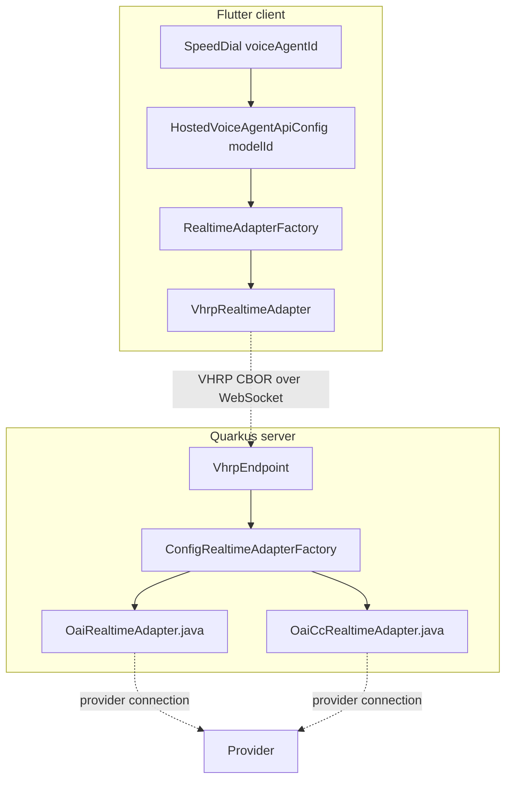
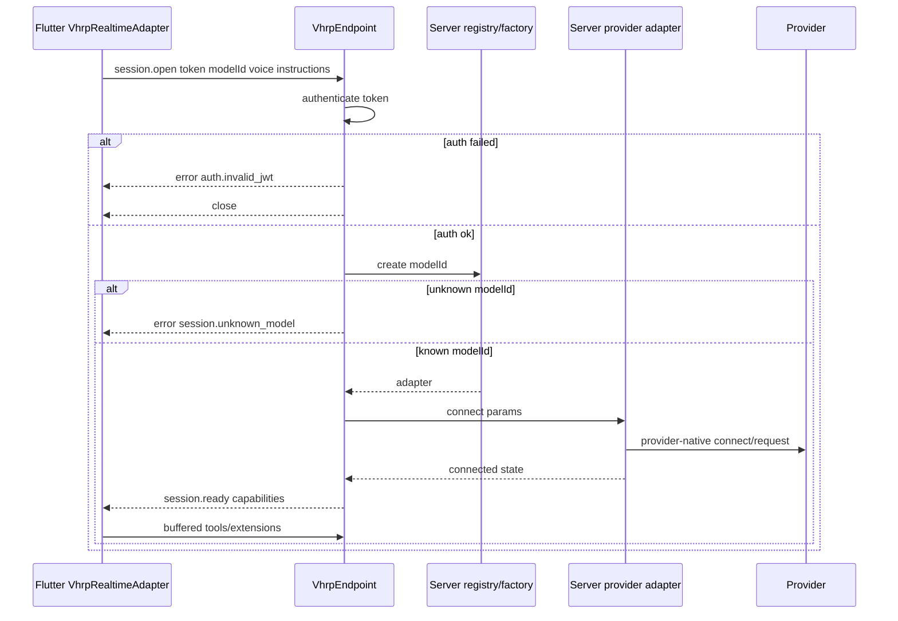

# Quarkus Backend Spec

## この文書の位置づけ

[01_adapter_boundary.md](./01_adapter_boundary.md) と [02_vhrp_wire_protocol.md](./02_vhrp_wire_protocol.md) を前提に、VHRP/1 の server 側実装方針と、Hosted-only 移行後の責務境界を定める。

現在の Flutter client は standalone/selfhosted voice realtime adapter を持たない。client は VHRP transport と server registry の voice-agent id だけを扱い、provider 種別、base URL、API key、provider model name はすべて Quarkus server 側に閉じる。

## 中核となる設計判断

### 判断1: client の realtime 実装は VHRP adapter だけである

Flutter の call path は Speed Dial に保存された voice-agent id を [`HostedVoiceAgentApiConfig`](../../lib/feat/call/models/voice_agent_api_config.dart) に包み、[`RealtimeAdapterFactory`](../../lib/feat/call/services/realtime/realtime_adapter_factory.dart) が [`VhrpRealtimeAdapter`](../../lib/feat/call/services/realtime/hosted/realtime_adapter.dart) を生成する。



client に provider switch は無い。provider 追加・差し替えは server registry と server adapter 実装だけで完結する。

### 判断2: provider 情報は server registry に閉じる

server は `vagina.realtime.models.<voiceAgentId>` で provider connection を解決する。public API は picker-safe な voice-agent metadata だけを返す。

```properties
vagina.realtime.default-model=voice-agent-prod

vagina.realtime.models.voice-agent-prod.provider=oai
vagina.realtime.models.voice-agent-prod.base-url=${OAI_REALTIME_BASE_URL:}
vagina.realtime.models.voice-agent-prod.api-key=${OAI_REALTIME_API_KEY:}
vagina.realtime.models.voice-agent-prod.transcription-model=${OAI_REALTIME_TRANSCRIPTION_MODEL:gpt-4o-mini-transcribe}

vagina.realtime.models.voice-agent-prod-cc.provider=oai_cc
vagina.realtime.models.voice-agent-prod-cc.base-url=${OAI_CC_BASE_URL:}
vagina.realtime.models.voice-agent-prod-cc.api-key=${OAI_CC_API_KEY:}
```

`GET /voice-agents` は `id`, `displayName`, `isDefault` だけを返す。`provider`, `baseUrl`, `apiKey`, provider model name は response に出さない。

### 判断3: Speed Dial が voice-agent selection を所有する

Voice-agent selection は global settings ではなく Speed Dial の `voiceAgentId` が所有する。

- 新規/default Speed Dial は server default voice-agent id を使う。
- Speed Dial config UI は `/voice-agents` registry から picker を表示する。
- call start は Speed Dial の `voiceAgentId` を VHRP `session.open.modelId` として送る。

OOBE と Settings に voice-agent connection setup は存在しない。

### 判断4: VHRP は provider 差異を wire に出さない

VHRP message は provider-native event/command を模倣しない。client から見る contract は thread patch、audio chunks、tool calls、provider extension ack/error であり、server adapter が provider-native API との翻訳を行う。

provider ごとの能力差は `session.ready.capabilities.extensions` と `error(extension.unsupported)` で吸収する。client UI は capability 結果に基づき自然に縮退し、provider 名を知る必要がない。

## パッケージ構造

### Flutter client

```text
lib/feat/call/services/realtime
├── realtime_adapter.dart              ; client-side adapter interface
├── realtime_adapter_factory.dart      ; hosted adapter only
├── realtime_provider_extensions.dart  ; provider extension wrapper; provider nameは露出しない
└── hosted
    ├── realtime_adapter.dart          ; VHRP adapter
    ├── vhrp_cbor_codec.dart
    ├── vhrp_messages.dart
    ├── vhrp_thread_projector.dart
    ├── vhrp_transport.dart
    ├── websocket_vhrp_connector.dart
    ├── websocket_vhrp_connector_io.dart
    ├── websocket_vhrp_connector_web.dart
    └── websocket_vhrp_transport.dart
```

`oai/` and `oai_cc/` standalone client adapters are intentionally absent.

### Quarkus server

```text
app.vagina.server.realtime
├── ConfigRealtimeAdapterFactory.java   ; modelId -> server provider adapter
├── RealtimeAdapter.java                ; server adapter interface
├── RealtimeModelsConfig.java           ; server registry config
├── VhrpEndpoint.java                   ; /api/hosted-realtime/v1/connect
├── VhrpSession.java                    ; connection/session state
├── VhrpMessage.java
├── VhrpCborCodec.java
├── model
│   ├── RealtimeThread.java
│   └── RealtimeAdapterModels.java
├── oai
│   └── ...                             ; server-side OpenAI realtime driver
└── oai_cc
    └── ...                             ; server-side Chat Completions driver
```

## Connection sequence



## Server registry API

`GET /voice-agents` is authenticated and returns only picker-safe data.

```json
[
  {
    "id": "voice-agent-prod",
    "displayName": "voice-agent-prod",
    "isDefault": true
  },
  {
    "id": "voice-agent-prod-cc",
    "displayName": "voice-agent-prod-cc",
    "isDefault": false
  }
]
```

The API intentionally does not expose provider-specific fields.

## Non-goals

- client-side provider selection
- client-side API key/base URL storage for voice realtime
- standalone/selfhosted voice realtime adapters in Flutter
- provider names in the public voice-agent list response
- VHRP wire messages that mirror provider-native event names
