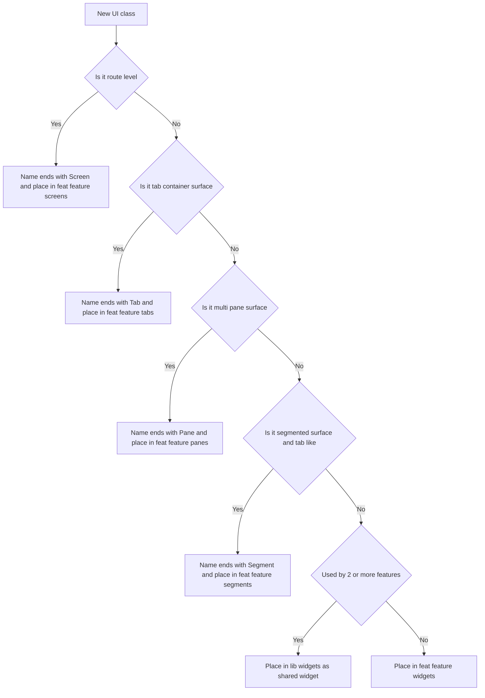

# UI Structure Rules (Screens vs Widgets)

This document defines the rules for placing UI code so that surfaces and non-surface widgets are clearly separated and consistently enforced.

## 1. Terms

### Screen
A **Screen** is a navigable, route-level destination or app-level surface.

- Class name ends with `Screen`
- Lives under a `screens/` directory

Examples:
- `HomeScreen`, `SettingsScreen`, `CallScreen`
- OOBE step screens such as `WelcomeScreen`

### Tab Surface
A **Tab** is a surface shown inside a tab container (eg bottom tabs, top tabs).

- Class name ends with `Tab`
- Lives under a `tabs/` directory (not under `screens/`)

Examples:
- `SpeedDialTab`, `SessionsTab`

### Pane Surface
A **Pane** is a surface shown as one of multiple panes (eg PageView, multi-column, split view).

- Class name ends with `Pane`
- Lives under a `panes/` directory (not under `screens/`)

Examples:
- `ChatPane`, `NotepadPane`

### Segment Surface
A **Segment** is a surface switched by a segmented-control style UI (eg Cupertino segmented control), when it is **tab-like in scope and behavior**.

- Class name ends with `Segment`
- Lives under a `segments/` directory (not under `screens/`)

Examples:
- `SessionDetailInfoSegment`, `SessionDetailChatSegment`

### Widget
A **Widget** is any UI widget that is not a Screen/Tab/Pane/Segment surface.

Examples:
- Headers, toolbars, section blocks, cards
- Tab bars, segmented controls wrappers
- Message bubbles, list rows, empty states

Terminology note:
- In Flutter, the correct term is **Widget**.
- The project currently uses a directory named [`lib/components`](../lib/components:1). As part of this refactor, it will be renamed to `lib/widgets/` (shared widgets).

## 2. Hard Rules

### R1. `screens/` contains Screen widgets only
Under any `screens/` directory, **only Screen widgets may exist**.

- A file under `screens/` must define exactly one public widget class whose name ends with `Screen`.
- No additional widget classes may live in the same file, even if private (eg `_Header`).
- No non-widget classes (models, helpers) may live in `screens/` either.

Current violations to fix:
- Private widgets inside [`_NotepadHeader`](../lib/screens/call/notepad_page.dart:158)
- Private widgets inside [`_ChatHeader`](../lib/screens/call/chat_page.dart:138)
- Private widgets inside [`_SessionInfoView`](../lib/screens/session/session_detail_screen.dart:161)
- Private widgets inside [`_SetupSection`](../lib/screens/settings/settings_screen.dart:84)
- Non-screen classes inside [`AuthProvider`](../lib/screens/oobe/authentication_screen.dart:5)
- Painter classes inside [`VoiceVisualizerBackgroundPainter`](../lib/screens/about/voice_visualizer_game.dart:343)

### R2. Naming conventions

- Screen widgets: `*Screen`
- Tab surfaces: `*Tab`
- Pane surfaces: `*Pane`
- Segment surfaces: `*Segment`

Notes:
- Tab/Pane/Segment are surfaces but are intentionally not named `*Screen`.
- Route-level or app-level destinations must be `*Screen`.

### R3. File naming under `screens/`

File names under `screens/` do not need to include `_screen` because the directory path already communicates that.

Examples:
- `lib/feat/home/screens/home.dart` exports `HomeScreen`
- `lib/feat/settings/screens/settings.dart` exports `SettingsScreen`

### R4. Widget placement

- Feature-scoped widgets: `lib/feat/<feature>/widgets/`
- Shared widgets (cross-feature): `lib/widgets/`

Rule of thumb:
- Used by 2+ features: put in `lib/widgets/`
- Used by 1 feature only: put in `lib/feat/<feature>/widgets/`

### R5. Import direction

- `screens` may import `tabs`, `panes`, `segments`, `widgets`, and shared widgets
- `tabs` / `panes` / `segments` may import `widgets` and shared widgets
- Feature `widgets` may import shared widgets
- Shared widgets must not import from any `screens/`, `tabs/`, `panes/`, or `segments/` directories

## 3. Segment surface decision rule (important)

A segmented control is sometimes just an ad-hoc filter/switch inside a screen, and sometimes it behaves like tabs.

Rule:
- If the segmented control switches **tab-like surfaces** (large scope, distinct states, distinct interactions), the switched targets are **Segment surfaces** in `segments/`.
- Otherwise, the switched targets remain ordinary **widgets** (eg `*Section`, `*View`) in `widgets/`.

Practical signals for “tab-like” (use overall judgement, not a single threshold):
- The switched content occupies the primary content area and is a major mode of the screen
- Each segment has its own scrollable body
- Each segment has its own empty/loading/error states
- Each segment has distinct actions (eg different menus, FABs, toolbars)
- The screen would be a candidate for true tabs in other apps

Reference example:
- [`SessionDetailScreen`](../lib/screens/session/session_detail_screen.dart:13) uses [`AdaptiveSegmentedControl`](../lib/components/adaptive_widgets.dart:487). We will decide whether its segments become `*Segment` based on the above signals.

## 4. Target UI Directory Architecture (feature-first)

Proposed layout:

- `lib/feat/<feature>/screens/`
- `lib/feat/<feature>/tabs/`
- `lib/feat/<feature>/panes/`
- `lib/feat/<feature>/segments/`
- `lib/feat/<feature>/widgets/`
- `lib/feat/<feature>/models/`
- `lib/widgets/` (shared widgets)

Candidate features based on current screens under [`lib/screens`](../lib/screens:1):
- `home`, `call`, `oobe`, `settings`, `session`, `speed_dial`, `about`

## 5. Classification Flow

## 6. Enforcement Strategy (planned)

Add an automated check in CI and locally:

- Fail if any file under `**/screens/` defines a class that does not end with `Screen`
- Fail if any file under `**/screens/` defines more than one `Widget` subclass
- Fail if any file under `**/screens/` defines a non-widget class (models/helpers)
- Fail if any file under `lib/widgets/` imports from `lib/feat/**/{screens,tabs,panes,segments}`

Implementation candidates:
- Dart script under [`scripts/`](../scripts:1) scanning file paths and regexing `class` declarations
