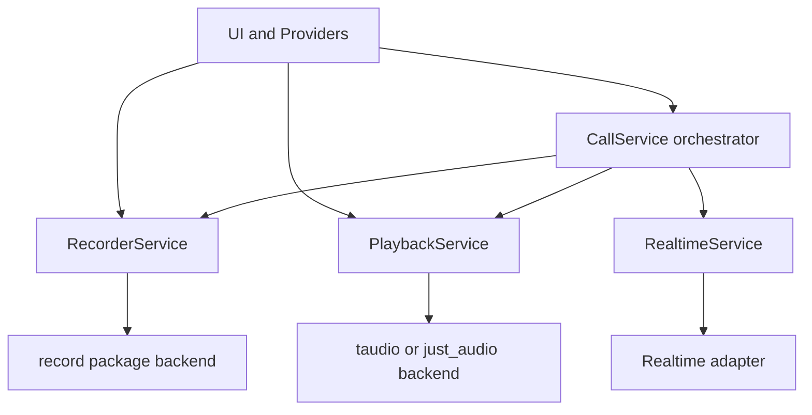

# Call Audio Services Design Spec

## Scope

Design two new session-scoped but UI-accessible services under [lib/feat/call/services](lib/feat/call/services):

- [RecorderService](lib/feat/call/services/recorder_service.dart)
- [PlaybackService](lib/feat/call/services/playback_service.dart)

These services should sit alongside [RealtimeService](lib/feat/call/services/realtime_service.dart) and [NotepadService](lib/feat/call/services/notepad_service.dart), and should replace the monolithic audio responsibilities currently bundled inside [CallAudioService](lib/services/audio/call_audio_service.dart:25).

The native libraries may remain the same as the legacy implementation, but the internal design should be rebuilt from scratch to match the current call-domain service style.

## Design Goals

1. Keep [CallService](lib/feat/call/services/call_service.dart:31) as an orchestrator rather than an audio implementation owner.
2. Allow UI and providers to observe and control recording and playback directly when needed.
3. Keep each service single-purpose.
4. Avoid reintroducing the legacy combined service shape from [CallAudioService](lib/services/audio/call_audio_service.dart:25).
5. Preserve compatibility with the current realtime transport expectations in [RealtimeService.bindAudioInput()](lib/feat/call/services/realtime_service.dart:68).
6. Support future replacement of native backends without changing the public service contracts.

## Architectural Position

## Service Boundary Rules

### [RecorderService](lib/feat/call/services/recorder_service.dart)
Owns microphone capture only.

It is responsible for:

- permission probing
- recording session lifecycle
- exposing PCM stream handles
- mute behavior at the recorder-service level
- exposing amplitude and recording state for UI
- Android recording configuration application
- disposing recorder resources

It is not responsible for:

- realtime connection logic
- assistant audio playback
- transcript logic
- call timers
- silence timeout policy
- tool execution

### [PlaybackService](lib/feat/call/services/playback_service.dart)
Owns assistant response playback only.

It is responsible for:

- accepting PCM response chunks
- buffering and output lifecycle
- interruption and stop semantics
- flushing response completion state
- reporting playback state and buffer state to UI
- disposing playback resources

It is not responsible for:

- microphone capture
- sending audio to the model
- tool execution
- transcript assembly
- session persistence

## Public Usage Model

The services are generic enough to be used directly by UI or by the orchestrator.

Example intended usage:

- [CallService.recorderService](lib/feat/call/services/call_service.dart)
- [CallService.playbackService](lib/feat/call/services/call_service.dart)
- `callService.recorderService.setMute false`
- `callService.playbackService.stop`

The exact Dart syntax will be implemented later, but the contract assumption is:

- [CallService](lib/feat/call/services/call_service.dart:31) exposes the concrete service instances or interface-typed getters
- UI may subscribe to service streams directly
- orchestration still happens from [CallService.startCall()](lib/feat/call/services/call_service.dart:68) and [CallService.endCall()](lib/feat/call/services/call_service.dart:228)

## RecorderService Specification

### Lifecycle

Suggested lifecycle states:

- `uninitialized`
- `idle`
- `starting`
- `recording`
- `stopping`
- `disposed`

Construction should be cheap and side-effect free.

A dedicated [start()](lib/feat/call/services/notepad_service.dart:5) style method should prepare internal objects, mirroring the shape already used by [RealtimeService.start()](lib/feat/call/services/realtime_service.dart:36) and [NotepadService.start()](lib/feat/call/services/notepad_service.dart:5).

Recommended lifecycle contract:

- constructor creates no active recording
- [start()](lib/feat/call/services/notepad_service.dart:5) prepares the recorder backend and moves to `idle`
- `startRecordingSession` begins one active microphone stream
- `stopRecordingSession` stops that active stream and returns to `idle`
- [dispose()](lib/feat/call/services/notepad_service.dart:7) tears down backend resources permanently

### Core Responsibilities

1. Wrap the native recorder backend currently used indirectly through [PcmRecorder](lib/services/audio/pcm_recorder.dart:20).
2. Publish a PCM16 mono 24kHz stream compatible with [AppConfig.sampleRate](lib/core/config/app_config.dart:32) and [AppConfig.channels](lib/core/config/app_config.dart:35).
3. Apply Android-specific settings from [AndroidAudioConfig](lib/models/android_audio_config.dart:4).
4. Support logical mute without stopping the recorder session.
5. Expose UI-friendly state streams.

### Muting Model

Muting should be handled inside the service contract, not by external stream rewriting.

Recommended behavior:

- when unmuted, output stream emits real PCM chunks
- when muted, output stream still emits same-sized silent PCM chunks
- recorder backend remains active while muted
- amplitude stream should emit `0.0` while muted for UI consistency

This preserves a stable upstream stream for [RealtimeService.bindAudioInput()](lib/feat/call/services/realtime_service.dart:68) and avoids rebinding on every mute toggle.

### Recommended Public API

Suggested surface:

- `Future<void> start()`
- `Future<void> dispose()`
- `Future<bool> hasPermission()`
- `Future<void> configureAndroid(AndroidAudioConfig config)` or synchronous setter if desired
- `Future<Stream<Uint8List>> startRecordingSession()`
- `Future<void> stopRecordingSession()`
- `void setMute(bool muted)`
- `bool get isMuted`
- `bool get isRecording`
- `Stream<double> get amplitudeStream`
- `Stream<RecorderServiceState> get states`
- `Stream<Uint8List> get audioStream` only while recording, if a persistent stream model is preferred

Preferred implementation detail:

- pick one of two models and stay consistent
- either `startRecordingSession` returns the stream
- or the service owns a broadcast [audioStream](lib/feat/call/services/realtime_service.dart) and `startRecordingSession` only transitions state

Recommended choice:

- expose a persistent broadcast `audioStream`
- let `startRecordingSession` only start feeding it

Reason:

- easier UI observation
- easier binding to [RealtimeService.bindAudioInput()](lib/feat/call/services/realtime_service.dart:68)
- cleaner mute implementation
- avoids returning a one-shot stream handle that callers must cache carefully

### Internal Design

Recommended internal parts:

- native backend adapter around `record`
- internal raw microphone subscription
- broadcast controller for output PCM stream
- broadcast controller for normalized amplitude
- state controller
- cached current mute flag
- cached current Android config

Suggested flow:

1. backend emits raw PCM chunk
2. service checks mute flag
3. service emits original chunk or same-sized silence chunk
4. service updates amplitude stream with normalized value or zero when muted
5. consumers receive a stable broadcast stream

### Error Semantics

- permission denial should throw a domain-specific exception or `StateError` at recording start
- repeated `startRecordingSession` while already recording should be idempotent or throw explicitly
- `stopRecordingSession` while idle should be safe and idempotent
- `dispose` after `dispose` should be safe

## PlaybackService Specification

### Lifecycle

Suggested lifecycle states:

- `uninitialized`
- `idle`
- `priming`
- `playing`
- `stopping`
- `disposed`

As with [RealtimeService](lib/feat/call/services/realtime_service.dart:13), construction should not touch native resources until [start()](lib/feat/call/services/realtime_service.dart:36) or first-use initialization.

Recommended contract:

- constructor is cheap
- [start()](lib/feat/call/services/notepad_service.dart:5) prepares output backend
- `bindInputStream` subscribes to an external assistant-audio PCM stream
- `markResponseComplete` closes the current response playback cycle
- `interrupt` stops playback immediately and clears pending buffered chunks
- [dispose()](lib/feat/call/services/notepad_service.dart:7) permanently releases backend resources

### Core Responsibilities

1. Replace the playback half of [CallAudioService.addAudioData()](lib/services/audio/call_audio_service.dart:90), [markResponseComplete()](lib/services/audio/call_audio_service.dart:203), and [stop()](lib/services/audio/call_audio_service.dart:215).
2. Accept PCM16 mono 24kHz audio.
3. Smooth playback using explicit response buffer management rather than the old queue loop shape.
4. Keep transport-facing semantics simple for [CallService](lib/feat/call/services/call_service.dart:31).
5. Allow direct piping from a realtime audio stream without requiring chunk-by-chunk orchestration calls.

### Buffering Model

Legacy behavior in [CallAudioService](lib/services/audio/call_audio_service.dart:158) accumulates chunks and starts playback after [AppConfig.minAudioBufferSizeBeforeStart](lib/core/config/app_config.dart:43).

The new design should keep the threshold concept but change the internals.

Recommended model:

- maintain a response-scoped buffer session
- accumulate chunks until the configured priming threshold is reached
- transition to `playing`
- drain sequentially through a backend-specific sink
- maintain explicit counters for buffered bytes and queued chunks
- track whether the current response has been marked complete
- finish playback only when response-complete is true and the queue is empty

This yields deterministic state and easier tests than the old `_isProcessingQueue` plus completer coupling in [CallAudioService](lib/services/audio/call_audio_service.dart:159).

### Recommended Public API

Suggested surface:

- `Future<void> start()`
- `Future<void> dispose()`
- `Future<void> bindInputStream(Stream<Uint8List> audioStream)`
- `Future<void> unbindInputStream()`
- `Future<void> markResponseComplete()`
- `Future<void> interrupt()`
- `Future<void> stop()`
- `Future<void> setVolume(double volume)`
- `bool get isPlaying`
- `int get bufferedBytes`
- `Stream<PlaybackServiceState> get states`
- `Stream<PlaybackMetrics> get metrics`

Optional but useful:

- `StreamSink<Uint8List> get inputSink` for test-only or adapter-only use, but not as the primary public contract
- `Future<void> beginResponse()` if the implementation wants explicit response boundaries

Recommended choice:

- prefer `bindInputStream` over a public writable stream member
- do not require `beginResponse`
- infer a response cycle when the first chunk arrives while idle

Reason:

- matches current realtime integration where audio arrives as deltas
- lets [CallService](lib/feat/call/services/call_service.dart:31) or [RealtimeService](lib/feat/call/services/realtime_service.dart:13) pipe a stream directly
- keeps subscription ownership and cancellation inside [PlaybackService](lib/feat/call/services/playback_service.dart)
- avoids exposing a long-lived writable sink as ambient mutable state

### Internal Architecture

Implement [PlaybackService](lib/feat/call/services/playback_service.dart) as a coordinator over a platform-specific output sink.

Recommended internals:

- `PlaybackOutputAdapter` interface hidden inside the file or subfolder
- non-Windows adapter using `taudio` stream playback
- Windows adapter using `just_audio` with temporary WAV wrapping, if retained initially
- input stream subscription owned by [PlaybackService](lib/feat/call/services/playback_service.dart)
- response buffer queue object
- state controller
- metrics controller
- single drain loop task with explicit cancellation token or generation id

Recommended invariants:

- only one drain loop active at a time
- `interrupt` invalidates the active generation and clears queue
- completed response only transitions to idle after all queued chunks are rendered or dropped
- metrics snapshot updates after every enqueue, dequeue, state change, and stop

### Response Completion Semantics

[markResponseComplete()](lib/services/audio/call_audio_service.dart:203) should mean:

- no more chunks are expected for the current assistant response
- the service may return to `idle` after queue drain completes
- if called before priming threshold is reached, already buffered audio should still be played
- if called while idle, it is a no-op

### Interrupt Semantics

`interrupt` is distinct from graceful response completion.

Recommended behavior:

- stop active playback immediately
- clear buffered chunks
- reset metrics
- move to `idle`
- safe to call repeatedly

This maps cleanly to [RealtimeService.interrupt()](lib/feat/call/services/realtime_service.dart:109) and call-level barge-in behavior.

## Integration with CallService

[CallService](lib/feat/call/services/call_service.dart:31) should own orchestration only.

### Constructor Shape

Preferred collaborators:

- [RealtimeService](lib/feat/call/services/realtime_service.dart:13)
- [RecorderService](lib/feat/call/services/recorder_service.dart)
- [PlaybackService](lib/feat/call/services/playback_service.dart)
- [ToolRunner](lib/feat/call/services/tool_runner.dart:16)
- [NotepadService](lib/feat/call/services/notepad_service.dart:2)

### Start Flow

Recommended [CallService.startCall()](lib/feat/call/services/call_service.dart:68) ordering:

1. create or validate collaborators
2. `await recorderService.start()`
3. `await playbackService.start()`
4. `await realtimeService.start()`
5. `await recorderService.startRecordingSession()`
6. `await realtimeService.bindAudioInput(recorderService.audioStream)`
7. subscribe to realtime thread and assistant audio events
8. bind the assistant audio stream into `playbackService.bindInputStream(...)`

### End Flow

Recommended [CallService.endCall()](lib/feat/call/services/call_service.dart:228) ordering:

1. stop thread subscriptions
2. `await realtimeService.unbindAudioInput()`
3. `await recorderService.stopRecordingSession()`
4. `await playbackService.stop()`
5. persist call artifacts
6. dispose or retain collaborators according to session model

### Direct Exposure

Because the services are intentionally UI-usable, [CallService](lib/feat/call/services/call_service.dart:31) may expose them via getters:

- `RecorderService get recorderService`
- `PlaybackService get playbackService`

This enables call-site patterns like:

- `callService.recorderService.setMute(true)`
- `callService.playbackService.states.listen(...)`

## Integration with RealtimeService

[RealtimeService](lib/feat/call/services/realtime_service.dart:13) should remain transport-focused.

Recommended responsibilities split:

- [RecorderService](lib/feat/call/services/recorder_service.dart) owns audio capture and mute
- [RealtimeService](lib/feat/call/services/realtime_service.dart:13) owns forwarding microphone PCM to the adapter
- [PlaybackService](lib/feat/call/services/playback_service.dart) owns local rendering of assistant PCM

Recommended additions for future implementation:

- keep [RealtimeService.bindAudioInput()](lib/feat/call/services/realtime_service.dart:68) as-is
- expose an assistant audio stream from the adapter or [RealtimeService](lib/feat/call/services/realtime_service.dart:13) so it can be piped into [PlaybackService.bindInputStream()](lib/feat/call/services/playback_service.dart)
- keep response-boundary signals separate from raw PCM so [markResponseComplete()](lib/services/audio/call_audio_service.dart:203) style semantics remain available
- avoid putting playback buffering inside [RealtimeService](lib/feat/call/services/realtime_service.dart:13)

## Migration Notes

### What should be reused

Reuse only these proven infrastructure choices:

- `record` package for microphone capture
- `taudio` for non-Windows stream playback if still appropriate
- `just_audio` fallback on Windows if needed
- audio constants in [AppConfig](lib/core/config/app_config.dart:6)
- Android tuning model in [AndroidAudioConfig](lib/models/android_audio_config.dart:4)

### What should not be copied forward

Do not port the internal structure of [CallAudioService](lib/services/audio/call_audio_service.dart:25) verbatim.

Specifically avoid:

- one class owning both recording and playback
- ad hoc boolean webs like `_isProcessingQueue` plus `_isStartingPlayback`
- implicit cross-concern state sharing between mic and playback
- forcing mute behavior to live in [CallService](lib/services/call_service.dart:162)

## Non Goals

This design intentionally does not define:

- Riverpod provider names
- exact UI widget integration
- silence timeout policy placement
- chat transcript architecture
- replacement of native libraries in this phase
- hosted voice-agent playback differences

## Test Strategy

### RecorderService tests

Create focused tests under [test/feat/call/services](test/feat/call/services):

- starts in idle after `start`
- exposes recording state transitions
- emits PCM chunks when unmuted
- emits silent same-sized chunks when muted
- emits zero amplitude while muted
- stop is idempotent
- dispose is idempotent

### PlaybackService tests

Create focused tests under [test/feat/call/services](test/feat/call/services):

- remains idle before chunks arrive
- primes until threshold is reached
- transitions to playing after threshold
- drains buffered chunks in order
- returns to idle only after `markResponseComplete` and queue drain
- interrupt clears queue immediately
- repeated stop and dispose are safe

### CallService integration tests

Add orchestrator tests for:

- binds recorder output into [RealtimeService.bindAudioInput()](lib/feat/call/services/realtime_service.dart:68)
- routes assistant audio into [PlaybackService](lib/feat/call/services/playback_service.dart)
- mute can be triggered through exposed [RecorderService](lib/feat/call/services/recorder_service.dart)
- end-call cleanup order is stable

## Implementation Outline

1. add [RecorderService](lib/feat/call/services/recorder_service.dart)
2. add [PlaybackService](lib/feat/call/services/playback_service.dart)
3. add any small internal state enums or snapshot models near those services
4. extend [CallService](lib/feat/call/services/call_service.dart:31) to own and expose both services
5. wire recorder output into [RealtimeService.bindAudioInput()](lib/feat/call/services/realtime_service.dart:68)
6. wire assistant audio output into playback once the adapter surface is available
7. add unit tests before removing legacy audio usage

## Decision Summary

Approved assumptions in this spec:

- the services are generic and UI-accessible
- [CallService](lib/feat/call/services/call_service.dart:31) remains the orchestrator
- mute belongs to [RecorderService](lib/feat/call/services/recorder_service.dart)
- playback interruption belongs to [PlaybackService](lib/feat/call/services/playback_service.dart)
- native packages may remain, but service internals should be redesigned rather than ported
