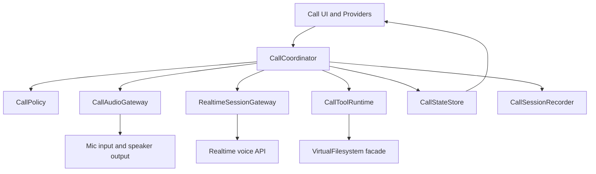

# Call Domain Rebuild Plan

## Scope

Target the call domain around [CallService](lib/OldServiceForRefDoNotImportThem/call_service.dart:37), and rebuild it around these axes:

- call orchestration
- audio I/O
- realtime voice API integration
- tool execution during calls
- user-facing call state and chat/open-file outputs

The current replacement shell in [lib/services/call/call_service.dart](lib/services/call/call_service.dart) is intentionally empty, so this is a good seam for rebuilding without dragging the old class structure forward.

## Current Diagnosis

The legacy [CallService](lib/OldServiceForRefDoNotImportThem/call_service.dart:37) currently owns too many responsibilities:

1. session lifecycle start and end
2. permission and config checks
3. wake lock control
4. realtime connection management
5. microphone streaming and audio playback coordination
6. chat transcript assembly through [ChatMessageManager](lib/OldServiceForRefDoNotImportThem/chat/chat_message_manager.dart:5)
7. tool sandbox bootstrapping and dynamic tool visibility
8. open-file state synchronization and persistence
9. silence timeout behavior
10. session persistence through [CallSessionRepository](lib/interfaces/call_session_repository.dart:4)
11. UI-facing stream fanout

This makes the old service a god object. Changes in one axis force edits in unrelated areas.

## Target Architecture

Rebuild the call domain as one orchestrator plus several narrow services.

## Service Boundaries

### 1. [CallCoordinator](lib/services/call/call_service.dart:5)
Application-layer orchestrator for a single call session.

Owns only orchestration:

- [startCall()](lib/OldServiceForRefDoNotImportThem/call_service.dart:200)
- [endCall()](lib/OldServiceForRefDoNotImportThem/call_service.dart:559)
- subscription wiring across collaborators
- high-level state transitions
- cancellation and cleanup ordering

Must not directly implement audio buffering, transcript mutation, tool registry logic, or repository details.

### 2. [CallPolicy](lib/OldServiceForRefDoNotImportThem/call_service.dart:183)
Encapsulates call preconditions and runtime rules.

Owns:

- config presence checks via [ConfigRepository](lib/interfaces/config_repository.dart:5)
- microphone permission checks
- silence timeout rules from [_resetSilenceTimer()](lib/OldServiceForRefDoNotImportThem/call_service.dart:524)
- end-context retention policy from [getLastEndContext()](lib/OldServiceForRefDoNotImportThem/call_service.dart:792)

This keeps business decisions out of orchestration code.

### 3. Audio boundary
Wrap old audio behavior behind a dedicated port and adapter.

Suggested split:

- interface: [CallAudioGateway](lib/OldServiceForRefDoNotImportThem/audio/call_audio_service.dart:25)
- implementation adapter over [CallAudioService](lib/OldServiceForRefDoNotImportThem/audio/call_audio_service.dart:25)

Owns:

- permission probe
- microphone stream start and stop
- amplitude stream
- response playback
- response completion markers
- local playback stop during interruption or teardown

### 4. Realtime boundary
Wrap the voice API client behind a call-specific interface.

Suggested split:

- interface over [RealtimeApiClient](lib/OldServiceForRefDoNotImportThem/realtime/realtime_api_client.dart:19)
- event stream contract for transcript, audio, tool-call lifecycle, errors, speech detection

Owns:

- connection and disconnection
- session configuration push
- sending user audio and text
- receiving assistant audio, transcript deltas, tool call events

The orchestrator should depend on a stable call-facing protocol rather than the raw event surface.

### 5. [CallToolRuntime](lib/tools/tools.dart:21)
Dedicated runtime for tool availability and execution during a call.

Owns:

- tool sandbox lifecycle
- loading tool catalog
- visibility resolution from speed dial and active files
- applying tool registration to voice or text runtime consumers
- open file mutation hooks related to tool execution

Extract logic currently spread across [_initializeToolsForCall()](lib/OldServiceForRefDoNotImportThem/call_service.dart:294), [onActiveFilesChanged()](lib/OldServiceForRefDoNotImportThem/call_service.dart:598), and [refreshToolsForActiveFiles()](lib/OldServiceForRefDoNotImportThem/call_service.dart:685).

### 6. Conversation state boundary
Replace direct chat mutation with a state-focused component.

Suggested split:

- [CallConversationStore](lib/OldServiceForRefDoNotImportThem/chat/chat_message_manager.dart:5)
- [OpenFilesStore](lib/OldServiceForRefDoNotImportThem/call_service.dart:598)

Owns:

- transcript assembly
- tool call rendering state
- pending user placeholder state
- open-file list snapshots for UI

This should expose immutable snapshots or streams for providers.

### 7. [CallSessionRecorder](lib/interfaces/call_session_repository.dart:4)
Persistence-only component.

Owns:

- translating in-memory call state into [CallSession](lib/models/call_session.dart)
- save on successful end
- restoring any persisted end-context policy if retained

Extract logic from [_saveSession()](lib/OldServiceForRefDoNotImportThem/call_service.dart:832).

### 8. UI provider layer
Keep Riverpod wiring thin in [lib/feat/call/state/call_service_providers.dart](lib/feat/call/state/call_service_providers.dart).

Owns only:

- dependency graph assembly
- lifecycle disposal
- exposing streams and facades to the UI

It should not contain construction shortcuts that bypass repositories or facades unless intentionally composed there.

## Dependency Direction

Preferred dependency flow:

- UI depends on application services
- application services depend on ports
- adapters implement ports using concrete infrastructure
- repositories remain behind interfaces

In practice:

- [CallCoordinator](lib/services/call/call_service.dart:5) depends on abstractions
- audio, realtime, tools, filesystem, and persistence implementations sit behind those abstractions
- [lib/feat/call/state/call_service_providers.dart](lib/feat/call/state/call_service_providers.dart) composes the concrete graph

## Session Start Data Model

If [CallService](lib/services/call/call_service.dart:5) is instantiated directly by the call screen instead of through Riverpod, then the first design question is not dependency injection but session input modeling.

The old flow mutates service state before start through [setAssistantConfig()](lib/OldServiceForRefDoNotImportThem/call_service.dart:178) and [setSpeedDialId()](lib/OldServiceForRefDoNotImportThem/call_service.dart:173), then calls [startCall()](lib/feat/call/screens/call.dart:288). That shape is fragile because a partially configured service can exist.

The rebuild should separate two kinds of inputs:

### Constructor inputs

These are stable collaborators and policies that the service needs for its whole lifetime.

Required constructor-side dependencies:

- audio gateway
- realtime gateway
- tool runtime factory or tool runtime dependency
- conversation store
- open files store
- session recorder
- call policy
- optional logger
- optional clock or id generator

These are not session data. They are the machinery.

### Session-start inputs

These are the facts that define one call session.

Minimum session-start payload:

- `speedDialId`
- `voice`
- `instructions`
- `enabledTools`

Why these belong to session start:

- [CallSession](lib/models/call_session.dart:33) persists [speedDialId](lib/models/call_session.dart:40)
- the old service applies [voice](lib/models/speed_dial.dart:19) and [systemPrompt](lib/models/speed_dial.dart:17) just before start in [lib/feat/call/screens/call.dart](lib/feat/call/screens/call.dart:279)
- tool visibility is seeded from [enabledTools](lib/models/speed_dial.dart:20) during [_initializeToolsForCall()](lib/OldServiceForRefDoNotImportThem/call_service.dart:307)

Recommended rule:

- a session-start object must contain everything needed to define assistant identity and initial tool posture
- [CallService](lib/services/call/call_service.dart:5) should not fetch [SpeedDial](lib/models/speed_dial.dart:2) by id during startup if the screen already has it

### Data that should stay outside session-start payload

These should usually remain in constructor dependencies or be resolved by dedicated collaborators:

- realtime URL and API key from [ConfigRepository](lib/interfaces/config_repository.dart:5)
- microphone permission checks
- Android audio tuning
- filesystem repository access
- wake lock control
- persistence strategy

These are environment and infrastructure concerns, not session identity.

### Recommended start contract

Prefer a single-shot API such as:

- `CallService.start sessionSpec`

where `sessionSpec` is a value object assembled by the screen or by a small factory near the navigation boundary.

Suggested contents of that value object:

- `speedDialId`
- `assistantName` if needed for future UI labeling
- `voice`
- `instructions`
- `enabledTools`
- optional `initialOpenFiles` only if the screen can intentionally resume a draft call context
- optional `metadata` for analytics or debugging, if truly needed

### What the call screen should assemble

At [lib/utils/call_navigation_utils.dart](lib/utils/call_navigation_utils.dart:13) and [lib/feat/call/screens/call.dart](lib/feat/call/screens/call.dart:15), the UI already knows the selected [SpeedDial](lib/models/speed_dial.dart:2). That means the screen can assemble the session input without asking repositories again.

The screen-side responsibility should be:

1. receive [SpeedDial](lib/models/speed_dial.dart:2)
2. map it into a session-start spec
3. instantiate [CallService](lib/services/call/call_service.dart:5) with stable collaborators
4. call a single start method with the session-start spec

### Constructor sketch

A healthy constructor shape is therefore:

- constructor receives services
- start method receives session definition

Not:

- constructor receives repositories plus mutable empty state
- later setters drip-feed session data into the service

### Key conclusion

To begin a call session, the truly essential data is:

1. which persona or speed dial is being used
2. what instructions define this session
3. which voice is used
4. which tools are initially enabled

Everything else is either infrastructure, policy, or runtime-derived state.

## Proposed Incremental Rebuild

### Phase 1
Create domain seams without feature changes.

- define new interfaces for audio, realtime, tools, conversation state, and persistence
- keep old implementations as adapters where possible
- make new [CallCoordinator](lib/services/call/call_service.dart:5) compile with minimal pass-through behavior

### Phase 2
Move lifecycle orchestration into the new coordinator.

- implement start and end flow
- centralize state transitions
- move cleanup ordering out of the legacy class

### Phase 3
Move user I/O concerns out of the coordinator.

- transcript and tool-call message assembly into conversation store
- amplitude and open-file publication into dedicated stores
- text send path separated from call lifecycle code

### Phase 4
Move tool runtime into its own service.

- sandbox lifecycle
- active-file-driven tool visibility
- open-file persistence hooks

### Phase 5
Move session persistence and runtime policy.

- session recording
- silence timeout policy
- end-context retention policy

### Phase 6
Remove legacy coupling.

- provider graph points only to rebuilt services
- delete or archive unused legacy pieces once feature parity is verified

## Migration Checkpoints

Each checkpoint should keep the app runnable.

1. new [CallCoordinator](lib/services/call/call_service.dart:5) is instantiated by providers
2. call start and end work through ports
3. realtime transcript and assistant audio flow through new boundaries
4. tool calls execute through [CallToolRuntime](lib/tools/tools.dart:21)
5. open files and chat state no longer require legacy [CallService](lib/OldServiceForRefDoNotImportThem/call_service.dart:37)
6. session save and cleanup no longer require legacy internals

## Concrete Handoff For Implementation

1. define new interfaces and models first
2. implement a thin [CallCoordinator](lib/services/call/call_service.dart:5)
3. wrap legacy audio and realtime classes in adapters
4. extract conversation state from [ChatMessageManager](lib/OldServiceForRefDoNotImportThem/chat/chat_message_manager.dart:5)
5. extract tool runtime from legacy [CallService](lib/OldServiceForRefDoNotImportThem/call_service.dart:294)
6. rewire [lib/feat/call/state/call_service_providers.dart](lib/feat/call/state/call_service_providers.dart) to the new graph
7. migrate tests around orchestration boundaries before deleting legacy code

## Design Principles

- one reason to change per service
- orchestrator does sequencing, not detailed work
- repositories stay persistence-only
- runtime adapters hide platform and API peculiarities
- UI consumes state snapshots and intents, not infrastructure services directly
- feature parity before cleanup deletion
