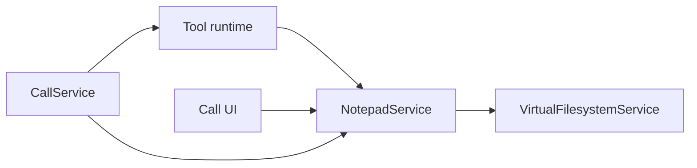

# Notepad Domain Boundary Analysis

## Conclusion

The current rebuild has not merely left [NotepadService](lib/feat/call/services/notepad_service.dart) unimplemented. It has also allowed notepad responsibilities to leak into adjacent services under the softer label of open files or active files. That leakage makes the system appear minimally functional while erasing the notepad boundary you want.

If the intended source of truth is [NotepadService](lib/feat/call/services/notepad_service.dart), then the current design is misaligned in three ways:

1. notepad state is owned by filesystem-facing services
2. notepad workflow is orchestrated by [CallService](lib/feat/call/services/call_service.dart)
3. notepad UI is bound to an infrastructure-shaped stream instead of a notepad domain model

## What NotepadService should own

Given your stated intent, [NotepadService](lib/feat/call/services/notepad_service.dart) should own all in-call document draft behavior:

- current tab set
- selected tab policy if needed
- draft content that may differ from persisted filesystem content
- open, update, close, rename style mutations if supported
- snapshot export for session persistence through [SessionNotepadTab](lib/models/call_session.dart:4)
- translation between filesystem-originated documents and UI-facing notepad state

Filesystem should only own durable storage of files. It should not be the runtime source of truth for the user notepad experience.

## Current responsibility displacement

### 1. Runtime notepad state was absorbed by filesystem adapters

The clearest displacement is in [CallFilesystemApi](lib/feat/call/services/call_filesystem_api.dart:10).

It contains:

- in-memory `_activeFiles` map in [CallFilesystemApi](lib/feat/call/services/call_filesystem_api.dart:13)
- open state mutation in [openFile()](lib/feat/call/services/call_filesystem_api.dart:64)
- draft lookup in [getActiveFile()](lib/feat/call/services/call_filesystem_api.dart:70)
- draft mutation in [updateActiveFile()](lib/feat/call/services/call_filesystem_api.dart:77)
- close semantics in [closeFile()](lib/feat/call/services/call_filesystem_api.dart:86)
- enumeration in [listActiveFiles()](lib/feat/call/services/call_filesystem_api.dart:92)

These are not persistence concerns. They are in-call editor state concerns. They are exactly the kind of responsibilities that belong in [NotepadService](lib/feat/call/services/notepad_service.dart:2).

This means the filesystem API currently acts as:

- document repository adapter
- in-memory draft store
- tab registry
- UI change emitter trigger

That is a domain boundary violation.

### 2. CallService became an accidental notepad coordinator

The new [CallService](lib/feat/call/services/call_service.dart:25) owns [_openFilesController](lib/feat/call/services/call_service.dart:47) and exposes [openFilesStream](lib/feat/call/services/call_service.dart:64).

It also reacts to filesystem-originated state changes in [_onActiveFilesChanged()](lib/feat/call/services/call_service.dart:191).

This makes [CallService](lib/feat/call/services/call_service.dart) the fanout point for notepad UI state, despite having a nominal [NotepadService](lib/feat/call/services/notepad_service.dart:2).

So the orchestration service now owns a view-model style stream for a domain it should not manage.

That is a second boundary violation.

### 3. ToolRunner now constructs the state source for notepad behavior

[ToolRunner](lib/feat/call/services/tool_runner.dart:20) creates [CallFilesystemApi](lib/feat/call/services/call_filesystem_api.dart:37) and injects [_onActiveFilesChanged](lib/feat/call/services/call_service.dart:191) through its constructor in [ToolRunner()](lib/feat/call/services/tool_runner.dart:31).

This means tool runtime assembly is also assembling the backing state mechanism for notepad behavior.

That creates a subtle inversion:

- tools should mutate notepad through a domain port
- instead the tool runtime owns the adapter that stores notepad drafts and publishes UI change notifications

The tool runtime is therefore doing more than execution. It is deciding where in-call document state lives.

That is a third boundary violation.

### 4. The UI contract is infrastructure-shaped, not domain-shaped

[openFilesStateProvider](lib/feat/call/state/open_files_controller.dart:45) subscribes to [openFilesStream](lib/feat/call/services/call_service.dart:64) and converts raw path and content tuples into [OpenFileTab](lib/models/open_file_tab.dart).

The pane itself, [OpenFilesPane](lib/feat/call/panes/open_files.dart:15), calls editing operations on [CallService](lib/services/call_service.dart:616) in the old design, and still assumes the existence of open-file editing APIs in the new UI contract.

This reveals a modeling problem:

- the UI is conceptually a notepad
- the exposed API is called open files
- the underlying state shape is active files
- the persistence target is [SessionNotepadTab](lib/models/call_session.dart:4)

Four names point at one behavior, and each name comes from a different layer.

That naming split is evidence that the boundary has been lost.

### 5. Session-history semantics exist, but the exporting service disappeared

The session model still expects [CallSession.notepadTabs](lib/models/call_session.dart:39).

The legacy [CallService._saveSession()](lib/services/call_service.dart:832) converted runtime open files into [SessionNotepadTab](lib/models/call_session.dart:4).

In the rebuild, that export responsibility has not been moved into [NotepadService](lib/feat/call/services/notepad_service.dart:2), even though it now belongs there according to your target model.

So an important notepad responsibility did not vanish. It became orphaned.

## Where the missing responsibilities went

This is the important diagnosis.

### Responsibilities that leaked into filesystem

These should belong to [NotepadService](lib/feat/call/services/notepad_service.dart:2), but currently live in [CallFilesystemApi](lib/feat/call/services/call_filesystem_api.dart:10):

- in-memory draft state
- file-open session state
- close semantics for draft tabs
- active document listing
- content mutation of active drafts
- change notifications for current notepad contents

### Responsibilities that leaked into CallService

These should belong to [NotepadService](lib/feat/call/services/notepad_service.dart:2), but currently live in [CallService](lib/feat/call/services/call_service.dart:25):

- UI stream publication through [openFilesStream](lib/feat/call/services/call_service.dart:64)
- domain reaction to document-state changes in [_onActiveFilesChanged()](lib/feat/call/services/call_service.dart:191)
- extension extraction from currently open documents for tool activation

The last bullet is especially important. Tool activation should depend on the current notepad snapshot, but [CallService](lib/feat/call/services/call_service.dart) is computing that directly from file tuples. The policy may be valid, but the data source should come from notepad domain state.

### Responsibilities that became orphaned

These existed in the old world and currently have no proper owner in the new one:

- session-export transformation into [SessionNotepadTab](lib/models/call_session.dart:4)
- explicit draft persistence policy at call end
- a stable domain API for UI edits and tab closure
- the single authoritative mapping between runtime draft state and persisted file state

## Architectural smell summary

The present rebuild shows a recurring anti-pattern:

minimum viable behavior was preserved by broadening neighboring services instead of finishing the missing service.

That produced these smells:

- [CallFilesystemApi](lib/feat/call/services/call_filesystem_api.dart) is no longer a pure filesystem adapter
- [ToolRunner](lib/feat/call/services/tool_runner.dart) now indirectly owns notepad-state construction
- [CallService](lib/feat/call/services/call_service.dart) exposes notepad state without notepad semantics
- [NotepadService](lib/feat/call/services/notepad_service.dart) exists only as a placeholder, which hides the fact that the domain boundary is already being violated elsewhere

This is worse than simple incompleteness, because later implementation work will have to first undo the accidental architecture.

## Correct boundary if NotepadService is the source of truth

The clean dependency shape is:

Interpretation:

- tools do not own active document state
- filesystem does not own draft document state
- [CallService](lib/feat/call/services/call_service.dart) does not publish raw open-file tuples as a substitute for notepad
- [NotepadService](lib/feat/call/services/notepad_service.dart) is the only owner of runtime document drafts
- [VirtualFilesystemService](lib/services/virtual_filesystem_service.dart) is invoked by [NotepadService](lib/feat/call/services/notepad_service.dart) when persistence is needed

## Recovery plan

### Step 1
Define [NotepadService](lib/feat/call/services/notepad_service.dart:2) as the owner of runtime note tabs.

It should expose:

- stream or value snapshots of current tabs
- open-or-replace draft entry
- update draft content
- close draft with optional persist
- list draft snapshots
- export session-history tabs
- persist-all-at-end behavior

### Step 2
Move the in-memory `_activeFiles` store out of [CallFilesystemApi](lib/feat/call/services/call_filesystem_api.dart:13).

[CallFilesystemApi](lib/feat/call/services/call_filesystem_api.dart) should become one of these:

- a thin adapter delegating draft-oriented methods into [NotepadService](lib/feat/call/services/notepad_service.dart:2) and persistence methods into [VirtualFilesystemService](lib/services/virtual_filesystem_service.dart:5)
- or a tool-facing port implementation created by [NotepadService](lib/feat/call/services/notepad_service.dart:2)

Either way, draft state must leave the filesystem adapter.

### Step 3
Remove notepad UI publication from [CallService](lib/feat/call/services/call_service.dart:47).

[CallService](lib/feat/call/services/call_service.dart) may re-expose [NotepadService](lib/feat/call/services/notepad_service.dart) streams temporarily if needed for compatibility, but it should not own the underlying controller.

### Step 4
Make tool activation depend on notepad snapshots, not raw filesystem callback payloads.

[CallService._onActiveFilesChanged()](lib/feat/call/services/call_service.dart:191) should be replaced with a subscription to [NotepadService](lib/feat/call/services/notepad_service.dart) state changes. It can still compute active extensions for tool visibility, but it should do so from notepad domain state.

### Step 5
Move session export and end-of-call persistence into [NotepadService](lib/feat/call/services/notepad_service.dart:2).

That service should provide:

- persist all current drafts
- export [List<SessionNotepadTab>](lib/models/call_session.dart:39)

Then [CallService](lib/feat/call/services/call_service.dart) can orchestrate by calling those methods during shutdown, without understanding document internals.

### Step 6
Rename UI-facing pieces after the domain, not the transport.

The current names:

- [OpenFilesPane](lib/feat/call/panes/open_files.dart:15)
- [openFilesStateProvider](lib/feat/call/state/open_files_controller.dart:45)
- [openFilesStream](lib/feat/call/services/call_service.dart:64)

encode old implementation details. If the product concept is notepad, the UI contract should eventually become notepad-centered as well.

## Recommended implementation order

1. introduce a real state model inside [NotepadService](lib/feat/call/services/notepad_service.dart:2)
2. route tool draft operations through [NotepadService](lib/feat/call/services/notepad_service.dart:2)
3. keep compatibility adapters for existing open-files UI
4. move session export and persist-all logic into [NotepadService](lib/feat/call/services/notepad_service.dart:2)
5. only then rename open-files UI and provider surfaces if desired

This order reduces breakage while restoring domain ownership first.
