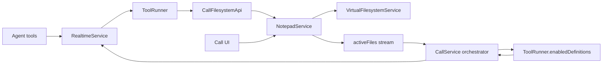

# Notepad Implementation Plan

## Confirmed decisions

- Tool names and JSON schemas visible to agents remain unchanged
- Within call domain, only [NotepadService](lib/feat/call/services/notepad_service.dart) may access [VirtualFilesystemService](lib/services/virtual_filesystem_service.dart)
- Request flow for agent-driven file work is:
  - agent
  - [RealtimeService](lib/feat/call/services/realtime_service.dart)
  - [ToolRunner](lib/feat/call/services/tool_runner.dart)
  - [Tool.execute](lib/services/tools_runtime/tool.dart)
  - [CallFilesystemApi](lib/feat/call/services/call_filesystem_api.dart)
  - [NotepadService](lib/feat/call/services/notepad_service.dart)
  - [VirtualFilesystemService](lib/services/virtual_filesystem_service.dart)
- Request flow for manual editing is:
  - UI
  - [NotepadService](lib/feat/call/services/notepad_service.dart)
  - [VirtualFilesystemService](lib/services/virtual_filesystem_service.dart)
- Persistence policy is hybrid
  - successful tool mutations write through immediately to VFS
  - UI save operations write through on explicit save action only
  - [NotepadService](lib/feat/call/services/notepad_service.dart) always keeps active state and latest content in memory
- Session export policy is minimal-diff
  - only tabs still open at call end are exported to [CallSession.notepadTabs](lib/models/call_session.dart:39)
- [NotepadService](lib/feat/call/services/notepad_service.dart) owns `activeFiles` as the only source of truth for in-call document state and exposes it via stream
- [CallService](lib/feat/call/services/call_service.dart) subscribes to `activeFiles` stream, extracts extensions, filters tool definitions, and registers them to [RealtimeService](lib/feat/call/services/realtime_service.dart)
- [ToolRunner](lib/feat/call/services/tool_runner.dart) is purely tool catalog and execution; it does not subscribe to anything or know about [NotepadService](lib/feat/call/services/notepad_service.dart)
- No callbacks for active file changes; use stream subscription instead

## Boundary model

## Service responsibilities

### [NotepadService](lib/feat/call/services/notepad_service.dart)
Own the full in-call document domain.

Must own:
- open tab registry (in-memory map of path → content)
- latest in-memory content for each open tab
- immediate write-through persistence to VFS
- session export to [SessionNotepadTab](lib/models/call_session.dart:4)
- `activeFiles` as the only source of truth for in-call document state
- `activeFiles` stream for external consumers

Must expose:
- `Stream<List<ActiveFile>>` or similar for UI and orchestrator
- synchronous APIs: `open(path, content)`, `update(path, content)`, `close(path)`, `read(path)`, `listActive()`
- asynchronous write-through to VFS on mutation
- `exportSessionTabs()` for session persistence

Must not own:
- tool catalog or tool-definition filtering logic
- transport concerns
- realtime session connection
- tool execution dispatch

### [CallFilesystemApi](lib/feat/call/services/call_filesystem_api.dart)
Compatibility adapter only.

Must do:
- preserve the existing external [FilesystemApi](lib/services/tools_runtime/apis/filesystem_api.dart:5) contract
- delegate all operations directly to [NotepadService](lib/feat/call/services/notepad_service.dart)
- for persistence operations (read/write/delete/move/list), delegate to [NotepadService](lib/feat/call/services/notepad_service.dart) which internally uses VFS
- for active-file operations (openFile/getActiveFile/updateActiveFile/closeFile/listActiveFiles), delegate to [NotepadService](lib/feat/call/services/notepad_service.dart) in-memory state

Must not do:
- hold `_activeFiles` itself
- emit independent state
- access [VirtualFilesystemService](lib/services/virtual_filesystem_service.dart) directly
- take callbacks

### [ToolRunner](lib/feat/call/services/tool_runner.dart)
Tool catalog and execution only.

Must do:
- execute tools via `execute(toolKey, argumentsJson)`
- provide `computeAvailableTools(Set<String> activeExtensions)` method that filters tool definitions based on:
  - initial `enabledToolKeys` from speed dial
  - activation rules (extensions) for each tool
- provide `allDefinitions` for full catalog
- own tool instances and their lifecycle

Must not do:
- subscribe to any streams
- know about [NotepadService](lib/feat/call/services/notepad_service.dart)
- know about [CallService](lib/feat/call/services/call_service.dart) except via [CallApi](lib/feat/call/services/call_control_api.dart)
- own file-open state
- cache or store active extensions

### [CallService](lib/feat/call/services/call_service.dart)
Session orchestration and reactive tool registration.

Must do:
- construct and own [NotepadService](lib/feat/call/services/notepad_service.dart), [ToolRunner](lib/feat/call/services/tool_runner.dart), and [RealtimeService](lib/feat/call/services/realtime_service.dart) (no external DI)
- subscribe to [NotepadService](lib/feat/call/services/notepad_service.dart) `activeFiles` stream
- extract active extensions from active files (e.g., `{'.md', '.csv'}`)
- call [ToolRunner.computeAvailableTools(activeExtensions)](lib/feat/call/services/tool_runner.dart) to get filtered definitions
- call [RealtimeService.registerTools()](lib/feat/call/services/realtime_service.dart) with those definitions
- call [NotepadService.exportSessionTabs()](lib/feat/call/services/notepad_service.dart) on shutdown
- provide UI compatibility stream by re-exposing [NotepadService](lib/feat/call/services/notepad_service.dart) state if needed

Must not do:
- own open-file state itself
- hold active files in its own controller as source of truth
- use callbacks for active file changes

## Data model

### [ActiveFile](lib/models/active_file.dart)
Renamed from `OpenFileState` for domain consistency.

Must have:
- `path: String` - absolute virtual file path
- `content: String` - current in-memory content
- `title: String` - computed filename from path
- `extension: String` - computed file extension
- `mimeType: String` - computed MIME type based on extension
- `toSessionTab() -> SessionNotepadTab` - convert to session export format

## Implementation todo

- [ ] Rename [OpenFileState](lib/models/open_file_state.dart) to [ActiveFile](lib/models/active_file.dart)
  - update all references across the codebase
  - maintain same properties and methods
- [ ] Implement runtime state model inside [NotepadService](lib/feat/call/services/notepad_service.dart)
  - in-memory map of active files
  - stream controller for activeFiles
- [ ] Add synchronous APIs on [NotepadService](lib/feat/call/services/notepad_service.dart)
  - `open(path, content)` - adds to active set, writes to VFS
  - `update(path, content)` - updates active content, writes to VFS
  - `close(path)` - removes from active set
  - `read(path)` - reads from VFS
  - `listActive()` - returns current active files snapshot
  - `exportSessionTabs()` - converts active files to SessionNotepadTab list
- [ ] Add `Stream<List<ActiveFile>>` to [NotepadService](lib/feat/call/services/notepad_service.dart)
- [ ] Move active file ownership out of [CallFilesystemApi](lib/feat/call/services/call_filesystem_api.dart)
- [ ] Rewrite [CallFilesystemApi](lib/feat/call/services/call_filesystem_api.dart) as thin adapter
  - inject [NotepadService](lib/feat/call/services/notepad_service.dart) instead of callback
  - delegate all methods directly
- [ ] Add `computeAvailableTools(Set<String> activeExtensions)` method to [ToolRunner](lib/feat/call/services/tool_runner.dart)
  - filters based on `_enabledToolKeys` from speed dial
  - filters based on `activation.isEnabledForExtensions(activeExtensions)` for each tool
  - returns fresh `List<ToolDefinition>` each call
- [ ] Remove [NotepadService](lib/feat/call/services/notepad_service.dart) and [CallService](lib/feat/call/services/call_service.dart) dependencies from [ToolRunner](lib/feat/call/services/tool_runner.dart)
  - keep only [CallApi](lib/feat/call/services/call_control_api.dart) for end-call tool
  - remove `onActiveFilesChanged` callback parameter
- [ ] Rework [CallService](lib/feat/call/services/call_service.dart)
  - remove `_openFilesController` as source of truth
  - remove `_onActiveFilesChanged` callback
  - remove `_currentActiveExtensions` field
  - subscribe to [NotepadService.activeFiles](lib/feat/call/services/notepad_service.dart) stream
  - on each update: extract extensions, call [ToolRunner.computeAvailableTools(extensions)](lib/feat/call/services/tool_runner.dart), call [RealtimeService.registerTools()](lib/feat/call/services/realtime_service.dart)
- [ ] Update [CallService](lib/feat/call/services/call_service.dart) to call [NotepadService.exportSessionTabs()](lib/feat/call/services/notepad_service.dart) on shutdown
- [ ] Keep current UI contract working by re-exposing [NotepadService](lib/feat/call/services/notepad_service.dart) stream from [CallService](lib/feat/call/services/call_service.dart) if needed for compatibility
- [ ] Add or update tests for [NotepadService](lib/feat/call/services/notepad_service.dart), [CallFilesystemApi](lib/feat/call/services/call_filesystem_api.dart), [ToolRunner](lib/feat/call/services/tool_runner.dart), and [CallService](lib/feat/call/services/call_service.dart)

## Recommended execution order

1. Rename [OpenFileState](lib/models/open_file_state.dart) to [ActiveFile](lib/models/active_file.dart) for domain consistency
2. Build [NotepadService](lib/feat/call/services/notepad_service.dart) state, API surface, and `activeFiles` stream
3. Adapt [CallFilesystemApi](lib/feat/call/services/call_filesystem_api.dart) to delegate into it (remove callback pattern)
4. Simplify [ToolRunner](lib/feat/call/services/tool_runner.dart) by removing all stream subscriptions and notepad awareness
5. Rewire [CallService](lib/feat/call/services/call_service.dart) to subscribe to [NotepadService](lib/feat/call/services/notepad_service.dart) and perform tool filtering
6. Restore UI compatibility by re-exposing notepad state
7. Restore session export via [NotepadService.exportSessionTabs()](lib/feat/call/services/notepad_service.dart)
8. Finish tests

## Key architectural decisions

- **Simpler dependency graph**: [CallService](lib/feat/call/services/call_service.dart) constructs and owns [NotepadService](lib/feat/call/services/notepad_service.dart), [ToolRunner](lib/feat/call/services/tool_runner.dart), and [RealtimeService](lib/feat/call/services/realtime_service.dart). No external DI or circular dependencies.
- **ToolRunner is pure**: [ToolRunner](lib/feat/call/services/tool_runner.dart) does not subscribe to anything. It is a stateless catalog and executor.
- **CallService is orchestrator**: [CallService](lib/feat/call/services/call_service.dart) owns the reactive logic for tool visibility. This is acceptable because it is ~10 lines of filtering logic, not a heavy computation.
- **No callbacks**: Stream subscription replaces callback pattern, making the flow easier to trace and test.
- **Domain terminology**: Use "active file" not "open file" - [OpenFileState](lib/models/open_file_state.dart) renamed to [ActiveFile](lib/models/active_file.dart).
- **Hybrid persistence**: Tool-driven changes persist immediately; UI-driven changes persist on explicit save.
- **Thin adapter pattern**: [CallFilesystemApi](lib/feat/call/services/call_filesystem_api.dart) preserves tool API contract while delegating to domain service.
