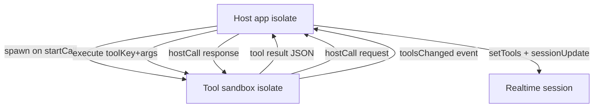

# Tool sandboxing via Dart Isolate (handoff plan)

## 0. Executive summary (why current is bad, why new is good)

### Why current implementation is unsafe

The current runtime executes tools **in the same isolate / same memory space** as the app and passes **live references to core objects** into tool code via [`ToolContext`](lib/services/tools_runtime/tool_context.dart:6).

This means:

- There is **no enforced trust boundary** between host and tool code.
- “Sandboxing” by directory placement (eg `lib/tools/`) is purely conceptual; the Dart VM does not prevent tools from mutating host state when they hold references.

Concrete consequences:

- Notepad: any tool holding [`NotepadService`](lib/services/notepad_service.dart:9) can change UI-sensitive state such as selecting tabs ([`NotepadService.selectTab()`](lib/services/notepad_service.dart:214)) or clearing all tabs ([`NotepadService.clearTabs()`](lib/services/notepad_service.dart:251)), even if the tool’s intended domain is only document content.
- Memory: memory tools hold a repository object and can execute persistence operations freely; the boundary is also not enforced structurally.

### Why isolate-based sandboxing improves the situation

With a Dart Isolate, **you cannot share arbitrary object references**. Communication is forced through **sendable data** (Map/List/primitive types and SendPort). Therefore:

- Tools cannot call host services directly because they cannot receive the service object.
- Side effects must be requested as **messages** (`hostCall`) and executed by the host.
- This is an architectural constraint, not a policy convention.

This approach targets the stated goal: sandboxing (message passing forced), not permission protocols.

## 1. Problem statement / motivation (with current code pointers)

Current tool runtime passes core in-process object references directly into tool code via [`ToolContext`](lib/services/tools_runtime/tool_context.dart:1).

### 1.1 Where tool context is constructed

[`ToolService.createToolRuntime()`](lib/services/tool_service.dart:92) constructs tool context and injects the notepad service:

- It builds a runtime registry and then:
  - `final context = ToolContext(notepadService: _notepadService)` ([`ToolService.createToolRuntime()`](lib/services/tool_service.dart:92))
  - `return registry.buildRuntimeForCall(context)` ([`ToolRegistry.buildRuntimeForCall()`](lib/services/tools_runtime/tool_registry.dart:71))

### 1.2 Where tools are executed

Realtime function calls are handled in [`CallService._setupApiSubscriptions()`](lib/services/call_service.dart:279). When a function call arrives:

- parse args
- call [`ToolRuntime.execute()`](lib/services/tools_runtime/tool_runtime.dart:29) with `toolKey` and args
- tool executes in-process with the same memory access.

### 1.3 Notepad example

[`DocumentOverwriteTool.execute()`](lib/tools/builtin/document_overwrite_tool.dart:53) calls `context.notepadService.updateTab(...)` and `createTab(...)` directly.

Because it holds a full service reference, tool code could also call:

- [`NotepadService.selectTab()`](lib/services/notepad_service.dart:214)
- [`NotepadService.clearTabs()`](lib/services/notepad_service.dart:251)
- any other method currently or later added.

Even though this might not happen in current builtin tools, the architecture allows it.

### 1.4 Notepad is not the only case

Memory tools also receive internal object references (repository instance) by constructor injection.

- [`MemorySaveTool`](lib/tools/builtin/memory_save_tool.dart:14)
- [`MemoryRecallTool`](lib/tools/builtin/memory_recall_tool.dart:14)
- [`MemoryDeleteTool`](lib/tools/builtin/memory_delete_tool.dart:14)

These repository instances are provided from [`ToolService`](lib/services/tool_service.dart:31) via `_runtimeToolFactories`.

### Target outcome

Enforce a trust boundary structurally: tools run in a Dart Isolate, and all interactions with host services happen via message passing only. No internal object references are shared with tool code.

This is not a “permission protocol” or “capability narrowing” exercise. The primary goal is isolation by architecture (hard boundary), while still allowing the full public functionality of the relevant tool surface.

## 2. Confirmed design decisions (from discussion)

- Sandboxing mechanism: **Dart Isolate** with message passing.
- Lifecycle: **1 isolate per call session**, spawned on call start and killed on call end.
- Concurrency: tool execution **sequential** inside the isolate.
- Scope: **all builtin tools** in [`lib/tools/builtin/builtin_tools.dart`](lib/tools/builtin/builtin_tools.dart:1) are moved to isolate execution.
- Compatibility policy: **delete, do not shim**. Remove the in-process runtime path entirely and delete obsolete files.
- Tool definitions:
  - Pre-call/local UI listing must remain **locally enumerable** without spawning sandbox.
  - During an active call session, **sandbox is source of truth for session tool definitions**, because future MCP/ephemeral tools may be dynamically registered during the session.
  - Definition updates are **sandbox → host push (event-driven)**. Host updates realtime session via [`RealtimeApiClient.setTools()`](lib/services/realtime/realtime_api_client.dart:138) and triggers session update.

## 3. Current architecture (as-is, more detail)

### 3.1 Tool registry + runtime

- [`ToolRegistry`](lib/services/tools_runtime/tool_registry.dart:19)
  - Caches definitions via [`ToolRegistry.listDefinitions()`](lib/services/tools_runtime/tool_registry.dart:49)
  - Builds per-call runtime via [`ToolRegistry.buildRuntimeForCall()`](lib/services/tools_runtime/tool_registry.dart:71)

- [`ToolRuntime`](lib/services/tools_runtime/tool_runtime.dart:7)
  - Holds `ToolContext` and tool instances.
  - Executes tool via [`ToolRuntime.execute()`](lib/services/tools_runtime/tool_runtime.dart:29) which calls `tool.init()` then `tool.execute(args, context)`.

### 3.2 ToolService wiring

[`ToolService`](lib/services/tool_service.dart:22) maintains `_runtimeToolFactories` for builtin tools.

- For memory tools, repo instance is injected at construction time.
- For notepad tools, service is injected indirectly via ToolContext.

### 3.3 CallService uses runtime

- On call start, [`CallService.startCall()`](lib/services/call_service.dart:183) creates a runtime.
- It sends tool definitions to realtime session via [`RealtimeApiClient.setTools()`](lib/services/realtime/realtime_api_client.dart:138).
- It executes tools on function call events.

Key issue: tool code runs in same isolate and gets direct object references.

## 4. Proposed architecture (to-be)

### 4.1 High-level flow

### 4.2 Boundary rules

- Only **sendable** values cross isolate boundary (Dart SendPort rules). Assume:
  - `null`, `bool`, `int`, `double`, `String`
  - `List` / `Map` whose elements/values are sendable
  - `SendPort`
- No passing:
  - service objects like [`NotepadService`](lib/services/notepad_service.dart:9)
  - repository objects like [`MemoryRepository`](lib/interfaces/memory_repository.dart:1)
  - closures, streams, controllers, etc.

### 4.3 Host-side components

1. `ToolSandboxManager` (new)
   - Spawns isolate on session start, kills on end.
   - Owns host ReceivePort and isolate SendPort.
   - Provides:
     - `Future<String> execute(toolKey,args)` (returns JSON string output)
     - Stream/callback `toolsChanged` event handling to update realtime tool set
   - Routes isolate `hostCall` requests to host services and replies.

2. Host API adapters (new)
   - `NotepadHostApi` uses [`NotepadService`](lib/services/notepad_service.dart:9) internally.
   - `MemoryHostApi` uses [`MemoryRepository`](lib/interfaces/memory_repository.dart:1) internally.
   - Exposed to isolate only via `hostCall` message types.

3. Runtime selection
   - There is **only one runtime**: isolate-backed execution.
   - Remove the in-process `ToolRegistry` + `ToolRuntime` execution path.
   - Repurpose [`ToolService`](lib/services/tool_service.dart:22) to:
     - enumerate builtin tool definitions locally for UI (pre-call)
     - provide session-scoped sandbox lifecycle helpers (spawn/kill and tool definition updates)

4. CallService integration
   - On call start:
     - spawn sandbox
     - register tool definitions from sandbox in realtime session
   - On toolsChanged push:
     - update tools in realtime session via [`RealtimeApiClient.setTools()`](lib/services/realtime/realtime_api_client.dart:138)

### 4.4 Isolate-side components

1. `ToolSandboxWorker` entrypoint (new)
   - Receives initial handshake from host with reply port.
   - Builds tool registry inside isolate.
   - Executes tool calls sequentially.
   - Performs hostCall roundtrips for side effects.
   - Supports dynamic tool registration for future MCP/ephemeral tools.
   - Emits `toolsChanged` events when session tool set changes.

2. Isolate-side tool context
   - Replace [`ToolContext`](lib/services/tools_runtime/tool_context.dart:6) contents with API clients, not host objects.
   - Example: `NotepadApiClient` that internally sends hostCall messages.

## 5. Message protocol (Map-only)

All messages are `Map<String,dynamic>`.

### 5.1 Envelope

- `type`: string
- `id`: unique request id string (required for request/response correlation)
- `replyTo`: SendPort (only on requests that expect a reply)
- `payload`: Map payload

### 5.2 Message types (minimum)

- `handshake`
  - host → isolate: provides host receive port / initial config
  - isolate → host: provides isolate send port or ack

- `execute`
  - payload: `{ toolKey: String, args: Map }`
  - response payload: `{ outputJson: String }`

- `listSessionDefinitions`
  - response payload: `{ tools: List<Map> }` where each item is realtime tool json (ie output of [`ToolDefinition.toRealtimeJson()`](lib/services/tools_runtime/tool_definition.dart:48))

- `hostCall`
  - payload: `{ api: String, method: String, args: Map }`
  - response payload: `{ ok: bool, result: Map|List|String|num|bool|null, error: String? }`

- `registerTool` / `unregisterTool`
  - used later for MCP/ephemeral tools
  - should trigger toolsChanged

- `toolsChanged` (push event)
  - isolate → host
  - payload: `{ tools: List<Map>, reason: String }` (all tools snapshot recommended initially)

## 6. Builtin tool catalog refactor

Problem: current host runtime registers tools via closures in [`ToolService`](lib/services/tool_service.dart:38). Closures are not sendable and can’t cross isolate.

Plan:

- Create a shared catalog that:
  - Enumerates builtin tool definitions locally (for UI pre-call listing)
  - Creates tool instances inside isolate without needing to pass closures

Implementation approach options:

1. Switch-based factory keyed by toolKey in isolate worker
   - `createBuiltinTool(toolKey)` returns Tool instance
   - uses explicit constructors; injects isolate clients for host APIs where needed

2. Static map of `toolKey -> ToolFactory` defined in a pure Dart file that is imported by both host and isolate
   - Note: still closures, but closures remain within the same isolate compilation unit; they are not passed across boundary.
   - Host uses it for listing definitions only.

Either way, make sure the isolate worker is the one instantiating tools.

## 7. Tool code changes

All builtin tools must stop depending on `context.notepadService` or raw repos.

- Notepad tools to migrate:
  - [`DocumentReadTool`](lib/tools/builtin/document_read_tool.dart:7)
  - [`DocumentOverwriteTool`](lib/tools/builtin/document_overwrite_tool.dart:7)
  - [`DocumentPatchTool`](lib/tools/builtin/document_patch_tool.dart:123)
  - [`NotepadListTabsTool`](lib/tools/builtin/notepad_list_tabs_tool.dart:7)
  - [`NotepadGetMetadataTool`](lib/tools/builtin/notepad_get_metadata_tool.dart:7)
  - [`NotepadGetContentTool`](lib/tools/builtin/notepad_get_content_tool.dart:7)
  - [`NotepadCloseTabTool`](lib/tools/builtin/notepad_close_tab_tool.dart:7)

- Memory tools to migrate:
  - [`MemorySaveTool`](lib/tools/builtin/memory_save_tool.dart:8)
  - [`MemoryRecallTool`](lib/tools/builtin/memory_recall_tool.dart:8)
  - [`MemoryDeleteTool`](lib/tools/builtin/memory_delete_tool.dart:8)

New dependencies:
- `ToolContext` should hold `NotepadApi` and `MemoryApi` interfaces.
- In-process runtime can provide direct implementations backed by host services.
- Isolate runtime provides client implementations that do `hostCall`.

## 8. Compatibility / feature flags

- **No compatibility shims**.
- **No feature flags**.
- Delete the old in-process runtime execution code once the isolate runtime is integrated.

Rationale: the goal is architectural sandboxing. Leaving an in-process fallback undermines the sandbox boundary and increases maintenance complexity.

## 9. Session tool definitions: local pre-call + sandbox session truth

Requirement:
- Pre-call UI lists locally (no isolate spawn). This uses builtin catalog definitions.
- On call start:
  - spawn sandbox isolate
  - fetch initial session definitions via `listSessionDefinitions` once
  - push to realtime via [`RealtimeApiClient.setTools()`](lib/services/realtime/realtime_api_client.dart:138)
- When sandbox emits `toolsChanged`:
  - host immediately updates realtime tool definitions (sessionUpdate)

## 10. Implementation sequence (precise, delete-old-first)

### 10.1 Add new files (explicit list)

- Protocol constants/helpers:
  - [`lib/services/tools_runtime/sandbox_protocol.dart`](lib/services/tools_runtime/sandbox_protocol.dart:1)
- Host-side sandbox manager:
  - [`lib/services/tools_runtime/tool_sandbox_manager.dart`](lib/services/tools_runtime/tool_sandbox_manager.dart:1)
- Isolate worker entrypoint:
  - [`lib/services/tools_runtime/tool_sandbox_worker.dart`](lib/services/tools_runtime/tool_sandbox_worker.dart:1)
- Builtin tool catalog (host pre-call listing + isolate instantiation):
  - [`lib/tools/builtin/builtin_tool_catalog.dart`](lib/tools/builtin/builtin_tool_catalog.dart:1)
- Tool-facing APIs (interfaces + isolate clients):
  - [`lib/services/tools_runtime/apis/notepad_api.dart`](lib/services/tools_runtime/apis/notepad_api.dart:1)
  - [`lib/services/tools_runtime/apis/memory_api.dart`](lib/services/tools_runtime/apis/memory_api.dart:1)
- Host adapters for `hostCall` routing:
  - [`lib/services/tools_runtime/host/notepad_host_api.dart`](lib/services/tools_runtime/host/notepad_host_api.dart:1)
  - [`lib/services/tools_runtime/host/memory_host_api.dart`](lib/services/tools_runtime/host/memory_host_api.dart:1)

### 10.2 Rewire the app to the sandbox (exact touchpoints)

1) Call lifecycle
- In [`CallService.startCall()`](lib/services/call_service.dart:183):
  - spawn sandbox isolate (`ToolSandboxManager.start()`)
  - request initial session tool definitions (`listSessionDefinitions`)
  - call [`RealtimeApiClient.setTools()`](lib/services/realtime/realtime_api_client.dart:138)

- In [`CallService._cleanup()`](lib/services/call_service.dart:510):
  - kill sandbox isolate (`ToolSandboxManager.dispose()`)

2) Tool execution
- In [`CallService._setupApiSubscriptions()`](lib/services/call_service.dart:279):
  - replace `runtime.execute(...)` with `sandbox.execute(toolKey,args)`
  - send the returned JSON output to [`RealtimeApiClient.sendFunctionCallResult()`](lib/services/realtime/realtime_api_client.dart:309)

3) Tool definition updates (push)
- Host listens to sandbox `toolsChanged` events and updates realtime:
  - [`RealtimeApiClient.setTools()`](lib/services/realtime/realtime_api_client.dart:138)
  - trigger session update (existing pattern in realtime client)

### 10.3 Refactor builtin tool wiring (no closures across boundary)

- Stop instantiating builtin tools via closures in [`ToolService`](lib/services/tool_service.dart:38).
- Provide a single place to:
  - list builtin definitions (for pre-call UI)
  - create builtin tool instances (for isolate worker)

### 10.4 Refactor builtin tools (explicit list)

Replace `context.notepadService` usage and repository injection with API calls.

Notepad:
- [`DocumentReadTool`](lib/tools/builtin/document_read_tool.dart:7)
- [`DocumentOverwriteTool`](lib/tools/builtin/document_overwrite_tool.dart:7)
- [`DocumentPatchTool`](lib/tools/builtin/document_patch_tool.dart:123)
- [`NotepadListTabsTool`](lib/tools/builtin/notepad_list_tabs_tool.dart:7)
- [`NotepadGetMetadataTool`](lib/tools/builtin/notepad_get_metadata_tool.dart:7)
- [`NotepadGetContentTool`](lib/tools/builtin/notepad_get_content_tool.dart:7)
- [`NotepadCloseTabTool`](lib/tools/builtin/notepad_close_tab_tool.dart:7)

Memory:
- [`MemorySaveTool`](lib/tools/builtin/memory_save_tool.dart:8)
- [`MemoryRecallTool`](lib/tools/builtin/memory_recall_tool.dart:8)
- [`MemoryDeleteTool`](lib/tools/builtin/memory_delete_tool.dart:8)

### 10.5 Delete old in-process execution implementation (explicit deletions)

Once the sandbox path is wired and tests pass, delete:

- [`lib/services/tools_runtime/tool_runtime.dart`](lib/services/tools_runtime/tool_runtime.dart:1)
- [`lib/services/tools_runtime/tool_context.dart`](lib/services/tools_runtime/tool_context.dart:1)

Also delete/refactor any remaining code paths that construct or call the in-process runtime:

- [`ToolService.createToolRuntime()`](lib/services/tool_service.dart:92) (repurpose or delete)
- Any usage of [`ToolRegistry.buildRuntimeForCall()`](lib/services/tools_runtime/tool_registry.dart:71) if it becomes unused

### 10.6 Tests (minimum acceptance)

- Sandbox lifecycle: spawn on [`CallService.startCall()`](lib/services/call_service.dart:183), kill on [`CallService._cleanup()`](lib/services/call_service.dart:510)
- Execute:
  - `document_overwrite` (create/update tab) end-to-end
  - `memory_save` + `memory_recall` end-to-end
- `toolsChanged` push: sandbox emits update → host updates realtime tool definitions
- Sendability: ensure hostCall results return only maps/lists/primitives (no `NotepadTab` objects)

## 11. Key risks / notes

- Isolate spawn overhead: acceptable because per-session.
- Ensure `toolsChanged` push cannot deadlock; keep host handler non-blocking.
- Beware of JSON strings vs Map payloads:
  - Existing tool plumbing expects tool output as JSON string.
  - Keep tool output as JSON string end-to-end initially to minimize changes.
- Ensure no accidental object references cross boundary (eg NotepadTab instances). Always convert to metadata map.

## 12. Current tracked TODOs (source of truth)

Use the in-repo TODO list maintained by Roo (see reminders). It already matches the plan and includes the toolsChanged push requirement.
